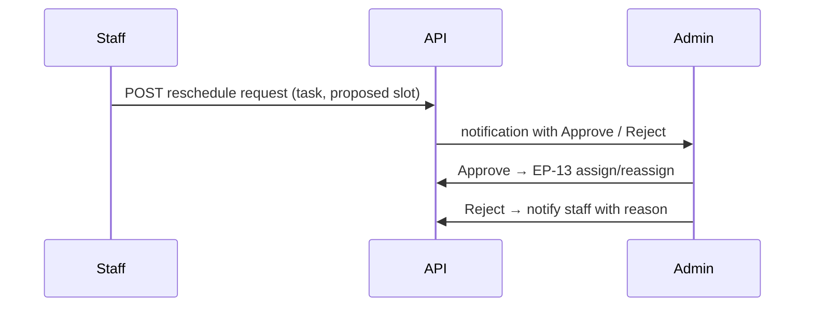

# Reminders and calendar clarity (v1)

Authoritative planning companion for ADR-0022. Code tickets **0071–0086** implement this package; **0070** is docs-only.

**ADR:** [0022-reminders-calendar-clarity.md](./adr/0022-reminders-calendar-clarity.md)

---

## 1. Reminder model (per task)

Reminders attach to a **task row**, not a case header.

| Field | Type | Required | Notes |
|-------|------|----------|-------|
| `reminder_date` | `date` | When reminder enabled | Surfaces on Reminders list and contributes to **red** calendar state when ≤ today |
| `reminder_note` | `text` | No | Shown in Reminders list and task detail tooltip |
| `deadline_date` | `date` | No | Optional hard deadline |
| `remind_days_before` | `integer` | No | When set with `deadline_date`, enter **amber** from `(deadline_date - remind_days_before)` through day before deadline; **red** on/after deadline |

**Lifecycle tasks** (13-task checklist): admin and assigned staff may set reminders on tasks they can update (mirrors EP-12/16 access).

**Personal tasks** (0079): creator sets reminders on own rows only.

### Due-state helpers (implementation seam)

| State | Rule (simplified) |
|-------|-------------------|
| `reminder_due` | `reminder_date` ≤ today and task not completed |
| `deadline_approaching` | `deadline_date` set, today ≥ `deadline_date - remind_days_before`, task not completed |
| `overdue` | `deadline_date` < today and not completed, **or** existing `is_overdue` cron flag |
| `at_risk` | Union of reminder_due, deadline_approaching, overdue, blocked, or case `is_urgent` |

---

## 2. Reminders navigation and list

| Role | Nav label | Route (proposed) |
|------|-----------|------------------|
| Admin | Reminders | `/reminders` |
| Staff | Reminders | `/staff/reminders` |

**Default filters:** Reminder due · At risk · Overdue (tabs or chips).

**Columns (v1):** Task name · Case reference (or “Firm task”) · Reminder date · Deadline · Status colour · Open case / Open task actions.

**Empty state:** “No reminders due — you're up to date.”

---

## 3. Calendar colour system

Apply to **admin schedule grid (S-04)**, **staff day/week/month calendar (S-11+)**, and **task board cards** where status dot exists (0048).

| Colour | Meaning | Priority (first match wins) |
|--------|---------|----------------------------|
| **Green** | `completed` | — |
| **Red** | `blocked` · case `is_urgent` · `reminder_date` ≤ today (open) · `deadline_date` < today (open) | Highest |
| **Amber** | `in_progress` · deadline approaching per `remind_days_before` · reminder due tomorrow (optional soften) | Middle |
| **Neutral / default** | `not_started` without risk signals | Base |

Tokens live in `design_system.md` §7 addendum (ticket 0074); implementation extends `assignment-status.ts` and board card tokens.

---

## 4. Schedule freshness (Realtime)

**Status:** Implemented (ticket 0075) — migration `00051_task_assignments_realtime.sql`, `useScheduleRealtime` hook.

**Scope:** `task_assignments` only (not full task board Realtime — ADR-0003).

| Viewer | Subscription filter |
|--------|---------------------|
| Staff | `staff_id = auth.uid()` |
| Admin | Firm-wide channel; client-side filter to viewed `date` in schedule components |

**On event:** `queryClient.invalidateQueries({ queryKey: queryKeys.schedule.all })`.

**Wired in:** `ScheduleGridView`, `StaffDayCalendarView` (not task board).

**Fallback:** 60s `refetchInterval` on schedule queries when Realtime disconnects (0027 pattern).

---

## 5. Notification toast and sound

**Status:** Implemented (ticket 0076).

| Setting | Default | Location |
|---------|---------|----------|
| Toast on new notification | ON | `NotificationsHost` + `useNotifications` |
| Sound on new notification | ON | `playNotificationSound` (Web Audio) |
| Mute sound | OFF (i.e. sound audible) | **My Profile** → `notification_sound_muted` via `PATCH /api/profile` |

Muted users still receive bell badge, drawer entries, and toast alerts.

---

## 6. Reschedule request flow

- Staff may request only for **their own** assignments.
- **EP-65** `POST /api/tasks/:id/reschedule-request` — body: `assignment_id`, `date`, `start_time`, `duration_minutes`, optional `note`; creates `reschedule_requests` row (`status = pending`) and fans out `reschedule_request` notifications to active admins.
- Slot validation reuses EP-13 rules (30-minute alignment, duration bounds, timetable, conflict check excluding the current task).
- One pending request per assignment (partial unique index).
- Approve runs conflict + timetable checks (EP-13) — **EP-66** `POST /api/reschedule-requests/:id/approve`.
- Reject requires optional reason text — **EP-66** `POST /api/reschedule-requests/:id/reject`.
- Admin notification centre: Approve / Reject on unread `reschedule_request` rows.
- Staff receive `reschedule_response` outcome notification (no actions).

---

## 7. Staff personal tasks

| Rule | Detail |
|------|--------|
| Case link | Optional `case_id` — must be case staff is **assigned to**, or **internal/firm** case |
| CRUD | Creator **edit/delete own** via EP-67; admin read (optional `staff_id` filter) |
| Schedule | Personal tasks with a scheduled slot appear on staff calendar (0080) |
| Reminders | Same fields as lifecycle tasks; union into `/api/reminders` deferred to 0080 |

Not a replacement for the 13-task checklist on client cases.

---

## 8. Week and month views

| Surface | Day (exists) | Week (0081) | Month (0082) |
|---------|--------------|------------------|-------------------|
| Admin schedule S-04 | ✓ | 0081 | 0082 |
| Staff calendar S-11 | ✓ | 0081 | 0082 |

Week: 7-column grid, same pills as day view.  
Month: compact cells — counts or dots per day; click drills to day/week.

---

## 9. Carry-over and yesterday strip

**Carry-over (staff + admin):** Incomplete assignments with `scheduled_date < today` (or end time in the past) still appear on **today's** calendar in a **carry-over** section or visually distinct band at top of day column.

**Yesterday pending strip (admin only):** Horizontal strip above schedule grid listing incomplete work from **yesterday** with quick links to case/task — complements carry-over (yesterday-specific admin hygiene).

---

## 10. Epic ticket map (0071–0086)

| Ticket | Scope (one line) |
|--------|------------------|
| **0071** | Migration: `reminder_date`, `reminder_note`, `deadline_date`, `remind_days_before` on tasks (+ personal task table if split) |
| **0072** | Server lib + API: set/clear reminders; query due/at-risk/overdue for Reminders list |
| **0073** | Reminders nav + list page (admin + staff shells) |
| **0074** | Calendar colour module: green / amber / red across schedule + board |
| **0075** | Realtime `task_assignments` + invalidate schedule query keys |
| **0076** | Toast + sound on notification; profile mute preference |
| **0077** | Reschedule request API (staff) → admin notification |
| **0078** | Reschedule approve/reject actions + staff outcome notification |
| **0079** | Staff personal tasks: DB + RLS |
| **0080** | Staff personal tasks UI (create/edit/delete own) |
| **0081** | Schedule **week** view (admin S-04 + staff S-11) |
| **0082** | Schedule **month** view (admin + staff) |
| **0083** | Carry-over incomplete work on today's calendar |
| **0084** | Admin yesterday pending strip |
| **0085** | Integration tests: reminders query, colours, Realtime schedule refresh |
| **0086** | Epic polish: USER_WORKFLOWS, nav wiring, manual smoke checklist |

**Dependency order:** 0071 → 0072 → 0073; 0074 parallel after 0072; 0075 parallel; 0076 after 0027 notifications; 0077–0078 sequential; 0079 → 0080; 0081–0082 after 0074; 0083–0084 after 0081; 0085–0086 last.

---

## 11. Doc updates per downstream ticket

| Artifact | Tickets |
|----------|---------|
| `database_schema.md` | 0071, 0077, 0079 |
| `api_specification.md` | 0072, 0077–0078, 0079 |
| `ui_wireframe_spec.md` | 0073, 0081–0084 |
| `design_system.md` | 0074 |
| `USER_WORKFLOWS.md` | 0086 |
| `test_plan.md` | 0085 |
