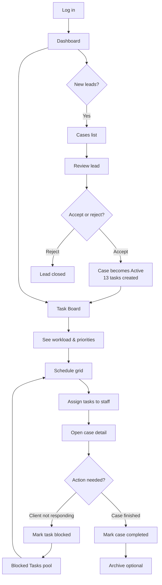
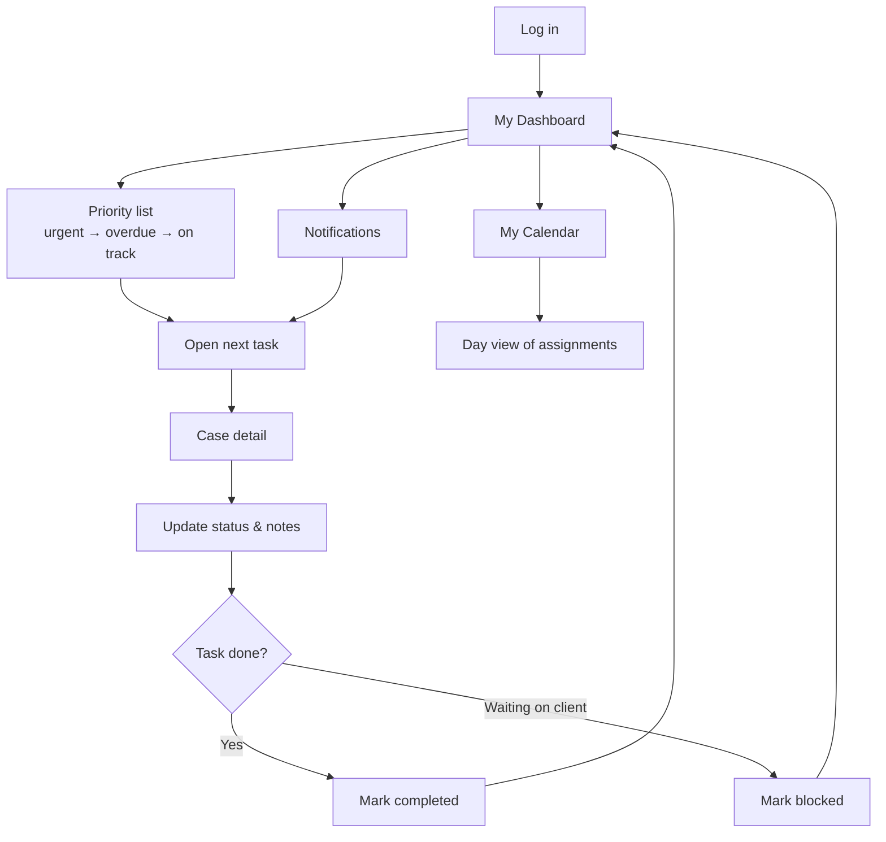
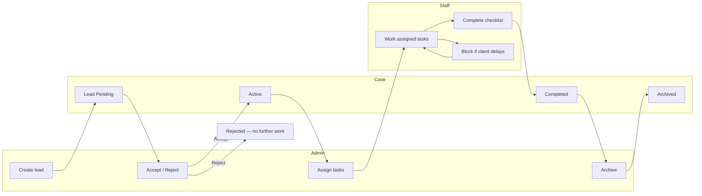

# User Workflows — Client Handoff Guide

**Audience:** Firm administrators and staff  
**Purpose:** How to use the system day to day  
**Last updated:** August 2026

---

## 1. Introduction

This application helps your firm manage immigration cases from first enquiry through to completion. Administrators run the office: reviewing new leads, scheduling work, and overseeing the team. Staff members work through their assigned tasks on a prioritised dashboard and personal calendar.

**Your live site:** `https://your-firm-app.vercel.app`  
*(Replace with your production URL after go-live.)*

**Sign in:** Open the URL above and use your firm email and password. If you forget your password, use **Forgot password** on the login screen.

If you open a protected page while signed out, you are sent to the login screen and returned to that page after a successful sign-in.

### Two main roles

| Role | Who | Landing page after login |
|------|-----|--------------------------|
| **Administrator** | Office manager / case coordinator | Dashboard (`/dashboard`) |
| **Staff** | Caseworkers handling assigned tasks | My Dashboard (`/staff/dashboard`) |

Staff only see cases and tasks assigned to them. Administrators see the full firm view.

---

## 2. Administrator — typical day

**In practice:**

1. **Log in** and check the **Dashboard** for urgent items, blocked tasks, and cases needing attention.
2. Open **Cases** to review **Lead — Pending** entries. Accept to create the standard task checklist and case reference, or reject with a reason.
3. Use the **Task Board** for a colour-coded view of all active work (urgent, approaching deadline, on track, blocked).
4. Open **Schedule** to assign tasks to staff on specific dates and time slots.
5. Open a **case** to edit client details, flag as urgent, manage dependants, and track the 13-task checklist.
6. If a client is not responding, staff (or you) can **mark a task blocked** — the time slot is freed and the task appears in **Blocked Tasks**.
7. When a case is finished, mark it **completed**. To remove it from the active list, **archive** it from case detail or the **Archive** page (restorable later).

---

## 3. Staff — typical day

**In practice:**

1. **Log in** — you land on **My Dashboard**, ordered by what needs attention first.
2. Work through the **priority list**; red/urgent items should be handled before others.
3. Open a task to reach **case detail** — update status (e.g. In Progress → Completed), add notes (saved automatically), and follow the checklist.
4. If you are waiting on the client, **mark the task blocked** and add a reason; your administrator is notified and the slot is released.
5. Use **My Calendar** for an hour-by-hour view of today’s assignments.
6. Check the **notification bell** for new assignments, urgent cases, and overdue reminders.

### Firm tasks vs client tasks

Firm operations work (e.g. “Clear emails”) appears in the **same priority list** as client tasks, ordered **urgent first**, then **scheduled time**:

- Firm rows show **task name** only. Action strip: **✓ Complete** → **◉ In progress** (no Open case).
- Client rows show reference, client name. Action strip: **✓** → **◉** → **Open case** (folder icon).
- **✓** works from `not_started` or `in_progress` when prerequisites pass; errors surface on the row.
- Completed firm tasks appear under **Show history** at the bottom of the list.

Staff cannot accept leads, assign tasks to others, or access firm-wide settings.

---

## 4. Case lifecycle (overview)

| Stage | What it means |
|-------|----------------|
| **Lead Pending** | New enquiry; not yet accepted. No tasks for staff. |
| **Active** | Accepted case with reference number and task checklist. |
| **Rejected** | Lead declined; closed permanently. |
| **Completed** | All work finished; case read-only. |
| **Archived** | Removed from active lists; can be restored by an administrator. |

---

## 5. What each role can and cannot do

| Capability | Administrator | Staff |
|------------|:-------------:|:-----:|
| Log in and change own password | ✓ | ✓ |
| View firm dashboard | ✓ | — |
| View personal priority dashboard | — | ✓ |
| Create new leads | ✓ | — |
| Accept or reject leads | ✓ | — |
| View all cases | ✓ | — |
| View only assigned cases | — | ✓ |
| Edit case details (active cases) | ✓ | — |
| Flag case as urgent | ✓ | — |
| Assign / reassign tasks on schedule | ✓ | — |
| Update task status on own assignments | ✓ | ✓ |
| Add task notes | ✓ | ✓ |
| Mark task blocked (with reason) | ✓ | ✓ |
| Unblock tasks | ✓ | ✓ |
| Senior review (Task 8 approve / revisions) | ✓ | — * |
| View blocked tasks pool (all cases) | ✓ | — |
| View task board (all staff) | ✓ | — |
| Personal day calendar | — | ✓ |
| Manage staff accounts | ✓ | — |
| Manage application types | ✓ | — |
| Archive or restore cases | ✓ | — |
| Permanently purge archived cases | ✓ | — |
| Receive in-app notifications | ✓ | ✓ |

\* *Senior reviewers (e.g. `senior@firm.com`) can approve or request revisions on Task 8; day-to-day staff use the Staff column above.*

---

## 6. Key URLs

Replace `https://your-firm-app.vercel.app` with your live address.

### Everyone

| Page | URL |
|------|-----|
| Login | `https://your-firm-app.vercel.app/login` |
| Forgot password | `https://your-firm-app.vercel.app/login/forgot-password` |

### Administrator

| Page | URL |
|------|-----|
| Dashboard | `/dashboard` |
| Task Board | `/task-board` |
| Cases | `/cases` |
| Case detail | `/cases/{case-id}` |
| Schedule (assign tasks) | `/schedule` |
| Blocked Tasks | `/blocked` |
| Archive | `/archive` |
| Team overview | `/team` |
| Application Types | `/settings/application-types` |
| Staff Members | `/settings/staff` |
| My Profile | `/settings/profile` |

### Staff

| Page | URL |
|------|-----|
| My Dashboard | `/staff/dashboard` |
| My Calendar | `/staff/calendar` |
| Case detail (assigned) | `/staff/cases/{case-id}` |
| My Profile | `/staff/profile` |

---

## 7. Login accounts (training / UAT only)

The following accounts exist in the **development and demo** environment. Passwords are listed in the internal [Deployment Guide](./deployment_guide.md) §3.6.

| Email | Role | Password (see deployment guide) |
|-------|------|----------------------------------|
| `admin@firm.com` | Administrator | §3.6 |
| `asha@firm.com` | Staff | §3.6 |
| `bless@firm.com` | Staff | §3.6 |
| `jaya@firm.com` | Staff | §3.6 |
| `senior@firm.com` | Senior reviewer | §3.6 |

**Production:** Create real accounts for each team member via **Settings → Staff Members** (admin). Do not use demo passwords in production. Deactivate leavers promptly from the same screen.

---

## 8. Quick tips

- **Urgent cases** appear highlighted for administrators and assigned staff — assign tasks quickly if nothing is scheduled yet.
- **Blocked tasks** free the calendar slot; administrators should reassign or follow up with the client.
- **Notes** on cases and tasks save automatically — look for “Saved ✓” at the bottom of the screen.
- **Search** (admin header): find cases by reference, client name, or other details without opening each list.
- **Archive** is reversible; permanent deletion is only available from the Archive page after the retention period.

For technical setup, hosting, and backups, refer to the [Deployment Guide](./deployment_guide.md) (IT / vendor use).
