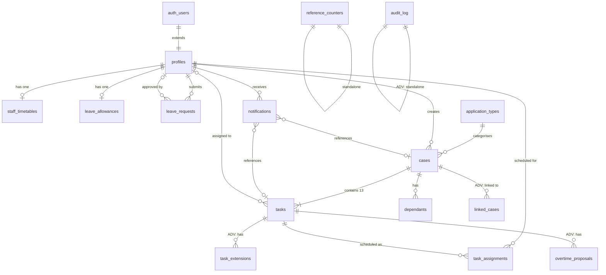

# Database Schema Document

**Project:** Team Scheduling & Task Management System  
**Version:** 1.0  
**Date:** 4 July 2026  
**Database:** PostgreSQL 15+ (via Supabase)  
**Sources:**
- [SRS_v4_MVP.md](./SRS_v4_MVP.md)
- [SRS_v4_Advanced.md](./SRS_v4_Advanced.md)
- [system_design.md](./system_design.md)
- [user_stories.md](./user_stories.md)

---

## 1. Data Model Overview

### 1.1 Design Principles

| Principle | Implementation |
|-----------|----------------|
| **Soft-delete everywhere** | Every user-facing table has `is_deleted` + `deleted_at`. No hard-deletes except admin purge after retention period. |
| **Audit timestamps** | Every table has `created_at` and `updated_at`, auto-managed by triggers. |
| **UUID primary keys** | All PKs are `uuid` using `gen_random_uuid()`. No serial integers exposed to users. |
| **UTC timestamps** | All `timestamptz` columns store UTC. Frontend converts to local timezone. |
| **Enums as PostgreSQL types** | Bounded value sets defined as custom `ENUM` types for type safety and validation. |
| **Nullable = optional** | A `NULL` column means the data is not yet available or not applicable. Every `NOT NULL` column has a clear business reason. |
| **3NF normalisation** | All tables are in Third Normal Form. Denormalisation only where explicitly noted for performance. |

### 1.2 Schema Namespace

All application tables live in the `public` schema. Supabase manages `auth` and `storage` schemas separately.

### 1.3 Scope Tags

Each table is tagged:
- **MVP** — required for initial launch
- **ADV** — required for Advanced/Phase 2 only

---

## 2. Enum Definitions

Enums are defined before tables since multiple tables reference them.

### 2.1 MVP Enums

#### `user_role`

```sql
CREATE TYPE user_role AS ENUM ('admin', 'senior', 'staff');
```

| Value | Description |
|-------|-------------|
| `admin` | Full system access. Can manage cases, staff, settings, schedules. |
| `senior` | Staff-level access + can be assigned to Task 8 (Senior Review) and approve/reject. |
| `staff` | Standard caseworker. Access limited to own assigned tasks and cases. |

> **Note:** `senior` is a sub-role of staff, not a separate role. RLS policies treat `senior` and `staff` identically for data access. The distinction only affects Task 8 assignment eligibility.

---

#### `online_status`

```sql
CREATE TYPE online_status AS ENUM ('online', 'break', 'offline');
```

| Value | Description |
|-------|-------------|
| `online` | Available and expected to respond to admin calls |
| `break` | Temporarily unavailable |
| `offline` | Not actively working |

---

#### `case_status`

```sql
CREATE TYPE case_status AS ENUM ('lead_pending', 'active', 'rejected', 'completed');
```

| Value | Description |
|-------|-------------|
| `lead_pending` | New lead awaiting admin review. No tasks generated. Not visible to staff. |
| `active` | Accepted. Reference generated. 13 tasks created. Visible to assigned staff. |
| `rejected` | Admin rejected the lead. Retained in DB for records. No tasks generated. |
| `completed` | All 13 tasks completed. Case closed. |

---

#### `task_status`

```sql
CREATE TYPE task_status AS ENUM ('not_started', 'in_progress', 'completed', 'blocked');
```

| Value | Description |
|-------|-------------|
| `not_started` | Task created but not yet begun |
| `in_progress` | Staff is actively working on the task |
| `completed` | Task finished. Protected — staff cannot undo (admin reversal is Advanced). |
| `blocked` | Awaiting client response. Time slot released. |

---

#### `senior_review_outcome`

```sql
CREATE TYPE senior_review_outcome AS ENUM ('pending', 'approved', 'revisions_required');
```

| Value | Description |
|-------|-------------|
| `pending` | Task 8 in progress, no decision yet |
| `approved` | Senior approved — Task 9 can proceed |
| `revisions_required` | Revisions needed — Task 5 reopened |

---

#### `leave_type`

```sql
CREATE TYPE leave_type AS ENUM ('holiday', 'sick');
```

---

#### `leave_status`

```sql
CREATE TYPE leave_status AS ENUM ('pending', 'approved', 'rejected');
```

---

#### `excess_leave_handling`

```sql
CREATE TYPE excess_leave_handling AS ENUM ('paid', 'salary_deduction');
```

| Value | Description |
|-------|-------------|
| `paid` | Excess leave approved as paid leave |
| `salary_deduction` | Excess leave flagged for payroll deduction |

---

#### `notification_type`

```sql
CREATE TYPE notification_type AS ENUM (
  'new_task',
  'urgent_case',
  'task_overdue',
  'task_blocked',
  'leave_approved',
  'leave_rejected',
  'leave_requested'
);
```

### 2.2 Advanced Enums (Phase 2)

#### `notification_type` — Extended Values

```sql
-- Alter the existing enum to add Phase 2 values
ALTER TYPE notification_type ADD VALUE 'extension_request';
ALTER TYPE notification_type ADD VALUE 'extension_approved';
ALTER TYPE notification_type ADD VALUE 'extension_denied';
ALTER TYPE notification_type ADD VALUE 'overtime_proposal';
ALTER TYPE notification_type ADD VALUE 'overtime_accepted';
ALTER TYPE notification_type ADD VALUE 'overtime_rejected';
ALTER TYPE notification_type ADD VALUE 'deadline_warning';
ALTER TYPE notification_type ADD VALUE 'blocked_reminder';
ALTER TYPE notification_type ADD VALUE 'appointment_alert';
```

#### `extension_status`

```sql
CREATE TYPE extension_status AS ENUM ('pending', 'approved', 'denied');
```

#### `overtime_compensation_type`

```sql
CREATE TYPE overtime_compensation_type AS ENUM ('fixed', 'hourly');
```

#### `overtime_proposal_status`

```sql
CREATE TYPE overtime_proposal_status AS ENUM ('pending', 'accepted', 'rejected');
```

#### `case_link_type`

```sql
CREATE TYPE case_link_type AS ENUM ('follow_up', 'related', 'dependant_application');
```

---

## 3. Entity List

### MVP Entities (9 tables)

| # | Table | Purpose | Key Relationships |
|---|-------|---------|-------------------|
| T1 | `profiles` | User profiles extending Supabase auth.users | 1:1 with auth.users |
| T2 | `application_types` | Admin-configurable visa/application types | Referenced by cases |
| T3 | `cases` | Central case record (lead → active → completed) | Has many tasks, dependants |
| T4 | `dependants` | Client's family members linked to a case | Belongs to case |
| T5 | `tasks` | Individual work items (13 default + up to 5 custom per case) | Belongs to case, assigned to profile |
| T6 | `task_assignments` | Scheduled time slots for tasks | Belongs to task + profile |
| T7 | `staff_timetables` | Weekly working hours per staff member | Belongs to profile |
| T8 | `notifications` | In-app notification records | Belongs to profile (recipient) |
| T9 | `reference_counters` | Atomic sequential counters for case references | Standalone |
| T16 | `case_document_preparations` | Saved wizard answers + merged snapshots per case/kind (ADR-0021) | Belongs to case |

### Advanced Entities (6 tables)

| # | Table | Purpose | Key Relationships |
|---|-------|---------|-------------------|
| T10 | `leave_allowances` | Annual leave entitlements and accrual config | Belongs to profile |
| T11 | `leave_requests` | Staff leave requests with approval workflow | Belongs to profile, approved by profile |
| T12 | `task_extensions` | Time extension requests and approvals | Belongs to task + profile |
| T13 | `overtime_proposals` | Overtime compensation proposals | Belongs to task + profile |
| T14 | `audit_log` | Full change history for all records | References any table/record |
| T15 | `linked_cases` | Relationships between related cases | Self-join on cases |

---

## 4. Table-by-Table Schema

---

### T1 · `profiles` — MVP

**Purpose:** Extends `auth.users` with application-specific fields. Every authenticated user has exactly one profile.

| # | Column | Type | Nullable | Default | Constraints | Description |
|---|--------|------|----------|---------|-------------|-------------|
| 1 | `id` | `uuid` | NO | — | PK, FK → `auth.users(id)` ON DELETE CASCADE | Matches Supabase auth user ID |
| 2 | `full_name` | `text` | NO | — | CHECK `length(full_name) >= 1` | Display name |
| 3 | `email` | `text` | NO | — | UNIQUE | Login email (mirrors auth.users) |
| 4 | `role` | `user_role` | NO | `'staff'` | — | Determines access level |
| 5 | `is_active` | `boolean` | NO | `true` | — | `false` = deactivated, cannot log in |
| 6 | `online_status` | `online_status` | NO | `'offline'` | — | Manually set by staff |
| 7 | `timezone` | `text` | YES | `'Europe/London'` | — | IANA timezone identifier (Advanced: auto-detected) |
| 8 | `created_at` | `timestamptz` | NO | `now()` | — | |
| 9 | `updated_at` | `timestamptz` | NO | `now()` | — | Auto-updated by trigger |

**Relationships:**
- `id` → `auth.users(id)` — 1:1, CASCADE delete
- Referenced by: `cases.created_by`, `tasks.assigned_to`, `tasks.completed_by`, `task_assignments.staff_id`, `leave_requests.staff_id`, `leave_requests.approved_by`, `notifications.user_id`, `leave_allowances.staff_id`

**Business Rules:**
- Profile is created automatically when a Supabase auth user is created (via database trigger or Supabase hook).
- When `is_active = false`, RLS policies block all data access for this user.

---

### T2 · `application_types` — MVP

**Purpose:** Admin-configurable list of visa/application types. Used in case creation and reference generation.

| # | Column | Type | Nullable | Default | Constraints | Description |
|---|--------|------|----------|---------|-------------|-------------|
| 1 | `id` | `uuid` | NO | `gen_random_uuid()` | PK | |
| 2 | `name` | `text` | NO | — | UNIQUE, CHECK `length(name) >= 2` | Full name, e.g., "Skilled Worker Visa" |
| 3 | `code` | `varchar(20)` | NO | — | UNIQUE, CHECK `code ~ '^[A-Z][A-Z0-9_]{1,19}$'` | Type abbreviation for references and document-prep mapping, e.g., `SKW`, `FM`, `SKD_OUT_UK` (ticket 0054 widened from 3-letter-only) |
| 4 | `is_active` | `boolean` | NO | `true` | — | Inactive types hidden from dropdowns but retained on existing cases |
| 5 | `sort_order` | `integer` | NO | `0` | — | Display ordering in dropdowns |
| 6 | `created_at` | `timestamptz` | NO | `now()` | — | |
| 7 | `updated_at` | `timestamptz` | NO | `now()` | — | |

**Seed Data:**

| name | code |
|------|------|
| Skilled Worker Visa | SKW |
| Graduate Visa | GRD |
| Spouse Visa | SPV |
| Indefinite Leave to Remain | ILR |
| Naturalisation | NAT |
| Fee Waiver | FWV |
| Further Leave to Remain | FLR |
| Skilled Worker Dependant | SKD |

**Business Rules:**
- Cannot hard-delete an application type if any case references it. Deactivate instead.
- The `code` is immutable once a case has used it (changing would break existing references).

---

### T3 · `cases` — MVP

**Purpose:** Central case record. Lifecycle: `lead_pending` → `active` → `completed` (or `rejected`).

| # | Column | Type | Nullable | Default | Constraints | Description |
|---|--------|------|----------|---------|-------------|-------------|
| 1 | `id` | `uuid` | NO | `gen_random_uuid()` | PK | |
| 2 | `reference` | `text` | YES | `NULL` | UNIQUE (where not null) | Auto-generated on acceptance. Format: `MMYYNO/TYPE/ABC`. NULL for leads. |
| 3 | `client_first_name` | `text` | NO | — | CHECK `length(client_first_name) >= 1` | Primary client first name |
| 4 | `client_last_name` | `text` | NO | — | CHECK `length(client_last_name) >= 1` | Primary client last name |
| 5 | `application_type_id` | `uuid` | NO | — | FK → `application_types(id)` | |
| 6 | `status` | `case_status` | NO | `'lead_pending'` | — | Current lifecycle stage |
| 7 | `is_urgent` | `boolean` | NO | `false` | — | Admin-toggled urgency flag |
| 8 | `senior_revision_count` | `integer` | NO | `0` | CHECK `senior_revision_count >= 0` | Incremented each time Task 8 returns Revisions Required |
| 9 | `last_date` | `date` | YES | `NULL` | — | Absolute deadline (e.g., visa expiry). Cannot be cleared once set. |
| 10 | `appointment_date` | `timestamptz` | YES | `NULL` | — | Set when Task 11 is completed. Cannot be cleared once set. |
| 11 | `notes` | `text` | YES | `NULL` | CHECK `length(notes) <= 2000` | General case notes |
| 12 | `created_by` | `uuid` | NO | — | FK → `profiles(id)` | Admin who created the lead |
| 13 | `accepted_at` | `timestamptz` | YES | `NULL` | — | Timestamp of acceptance |
| 14 | `completed_at` | `timestamptz` | YES | `NULL` | — | Timestamp when all 13 tasks completed |
| 15 | `fee_agreement` | `text` | YES | `NULL` | — | Advanced: optional fee notes at lead stage |
| 16 | `is_deleted` | `boolean` | NO | `false` | — | Soft-delete flag |
| 17 | `deleted_at` | `timestamptz` | YES | `NULL` | — | When soft-deleted |
| 18 | `deleted_by` | `uuid` | YES | `NULL` | FK → `profiles(id)` | Who soft-deleted |
| 19 | `created_at` | `timestamptz` | NO | `now()` | — | |
| 20 | `updated_at` | `timestamptz` | NO | `now()` | — | |
| 21 | `is_internal` | `boolean` | NO | `false` | — | Hidden firm-operations case for ad-hoc schedule work (ADR-0019). Excluded from case list, search, and assignable picker. |

**Relationships:**
- `application_type_id` → `application_types(id)` — Many:1
- `created_by` → `profiles(id)` — Many:1
- `deleted_by` → `profiles(id)` — Many:1 (nullable)
- Has many: `tasks`, `dependants`
- Advanced: has many `linked_cases` (self-join)

**Business Rules:**
- `reference` is generated only when `status` transitions from `lead_pending` to `active`.
- `reference` is **editable by administrators** after generation. The UNIQUE constraint ensures edited references do not collide with existing ones. This is necessary because the reference is also used in external software where the ordering may differ.
- `last_date` and `appointment_date` use the "cannot be cleared once set" rule. This is enforced via an API-level check (a `BEFORE UPDATE` trigger can also enforce this).
- `status` transitions: `lead_pending` → `active` | `rejected`. `active` → `completed`. No other transitions.
- `completed_at` is set automatically when the last of the case's tasks (default + custom) are marked `completed`.
- **Seed (0043):** One internal case (`reference = FIRM-GENERAL`, client "Firm operations", `is_internal = true`) holds ad-hoc schedule tasks; never shown in client-facing case UIs.

**Immutability Constraints (enforced via trigger or API):**

```
IF OLD.last_date IS NOT NULL AND NEW.last_date IS NULL → REJECT
IF OLD.appointment_date IS NOT NULL AND NEW.appointment_date IS NULL → REJECT
```

> **Note:** The `reference` field was previously immutable but is now editable by administrators. The UNIQUE constraint on `reference` still prevents duplicate references.

---

### T4 · `dependants` — MVP

**Purpose:** Family members associated with a case's primary client.

| # | Column | Type | Nullable | Default | Constraints | Description |
|---|--------|------|----------|---------|-------------|-------------|
| 1 | `id` | `uuid` | NO | `gen_random_uuid()` | PK | |
| 2 | `case_id` | `uuid` | NO | — | FK → `cases(id)` ON DELETE CASCADE | Parent case |
| 3 | `name` | `text` | NO | — | CHECK `length(name) >= 1` | Dependant's full name |
| 4 | `relationship` | `text` | NO | — | CHECK `relationship IN ('spouse', 'partner', 'child', 'other')` | Dependant relationship to primary client (ticket 0054) |
| 5 | `is_deleted` | `boolean` | NO | `false` | — | Soft-delete |
| 6 | `deleted_at` | `timestamptz` | YES | `NULL` | — | When soft-deleted |
| 7 | `deleted_by` | `uuid` | YES | `NULL` | FK → `profiles(id)` | Who soft-deleted |
| 8 | `created_at` | `timestamptz` | NO | `now()` | — | |
| 9 | `updated_at` | `timestamptz` | NO | `now()` | — | |

**Relationships:**
- `case_id` → `cases(id)` — Many:1, CASCADE

**Denormalisation Note:**
The task board displays client names as "Vishnu + 2 children". Rather than JOINing on every board render, consider a `dependant_summary` computed column or a materialised count on the `cases` table. However, for MVP scale (~500 cases), the JOIN is negligible. Defer denormalisation.

---

### T16 · `case_document_preparations` — Post-MVP (ADR-0021, ticket 0055)

**Purpose:** Persist wizard answers and merged text/HTML for on-demand DOCX/PDF export. At most one row per `(case_id, kind)`; overwrite on save.

| # | Column | Type | Nullable | Default | Constraints | Description |
|---|--------|------|----------|---------|-------------|-------------|
| 1 | `id` | `uuid` | NO | `gen_random_uuid()` | PK | |
| 2 | `case_id` | `uuid` | NO | — | FK → `cases(id)` ON DELETE CASCADE | Parent case |
| 3 | `kind` | `text` | NO | — | CHECK `kind IN ('covering_letter', 'parental_consent')` | Document kind |
| 4 | `variant_id` | `text` | NO | — | — | Registry variant, e.g. `covering_skw_solo` |
| 5 | `wizard_schema_id` | `text` | NO | — | — | Wizard schema id |
| 6 | `answers` | `jsonb` | NO | `'{}'` | — | Wizard field answers |
| 7 | `merged_text` | `text` | NO | `''` | — | Plain-text merge snapshot |
| 8 | `merged_html` | `text` | YES | `NULL` | — | Optional HTML preview |
| 9 | `created_by` | `uuid` | NO | — | FK → `profiles(id)` | |
| 10 | `updated_by` | `uuid` | NO | — | FK → `profiles(id)` | |
| 11 | `created_at` | `timestamptz` | NO | `now()` | — | |
| 12 | `updated_at` | `timestamptz` | NO | `now()` | — | |

**Constraints:** `UNIQUE (case_id, kind)` — one covering letter and one parental consent per case.

**RLS:** Mirrors case/dependant access — admin on non-deleted writable cases; staff/senior on `staff_assigned_active_case_ids()` only. No DELETE policy (overwrite via UPSERT in API 0059).

---

### T5 · `tasks` — MVP

**Purpose:** Individual work items. Exactly 13 are auto-created per accepted case, representing the fixed lifecycle.

| # | Column | Type | Nullable | Default | Constraints | Description |
|---|--------|------|----------|---------|-------------|-------------|
| 1 | `id` | `uuid` | NO | `gen_random_uuid()` | PK | |
| 2 | `case_id` | `uuid` | NO | — | FK → `cases(id)` ON DELETE CASCADE | Parent case |
| 3 | `sequence` | `smallint` | NO | — | CHECK `sequence >= 1` | Task order in lifecycle (1–13 = default, 14+ = custom) |
| 4 | `name` | `text` | NO | — | — | Full task name, e.g., "CCL (Client Care Letter)" |
| 5 | `abbreviation` | `varchar(20)` | NO | — | — | Short name for task board, e.g., "CCL", "App", "DU" |
| 6 | `description` | `text` | YES | `NULL` | — | Task description from the SRS lifecycle table |
| 7 | `status` | `task_status` | NO | `'not_started'` | — | Current state |
| 8 | `assigned_to` | `uuid` | YES | `NULL` | FK → `profiles(id)` | NULL until admin assigns. Staff member responsible. |
| 9 | `notes` | `text` | YES | `NULL` | CHECK `notes IS NULL OR length(notes) <= 500` | Inline notes visible on task board |
| 10 | `is_urgent` | `boolean` | NO | `false` | — | Derived from parent case `is_urgent`. Can also be set independently. |
| 11 | `is_overdue` | `boolean` | NO | `false` | — | Set by `detect-overdue` cron when past allocated end time |
| 12 | `is_custom` | `boolean` | NO | `false` | — | `true` for admin-created custom tasks (sequence >= 14). `false` for the 13 default lifecycle tasks. |
| 12 | `blocked_at` | `timestamptz` | YES | `NULL` | — | When task entered blocked state. NULL if not blocked. |
| 13 | `blocked_reason` | `text` | YES | `NULL` | — | Optional reason for blocking |
| 14 | `completed_at` | `timestamptz` | YES | `NULL` | — | When task was marked completed |
| 15 | `completed_by` | `uuid` | YES | `NULL` | FK → `profiles(id)` | Who marked it complete |
| 16 | `senior_approval` | `senior_review_outcome` | YES | `NULL` | — | Only populated for Task 8 (sequence = 8). NULL for all other tasks. |
| 17 | `revision_notes` | `text` | YES | `NULL` | — | Notes from senior when requesting revisions (Task 8) |
| 18 | `priority_position` | `integer` | YES | `NULL` | — | Manual priority override (Advanced). NULL = auto-calculated. |
| 19 | `is_overtime` | `boolean` | NO | `false` | — | Advanced: true if scheduled outside working hours |
| 20 | `is_deleted` | `boolean` | NO | `false` | — | Soft-delete |
| 21 | `deleted_at` | `timestamptz` | YES | `NULL` | — | When soft-deleted |
| 22 | `deleted_by` | `uuid` | YES | `NULL` | FK → `profiles(id)` | Who soft-deleted |
| 23 | `created_at` | `timestamptz` | NO | `now()` | — | |
| 24 | `updated_at` | `timestamptz` | NO | `now()` | — | |

**Unique Constraint:**

```sql
UNIQUE (case_id, sequence) WHERE is_deleted = false
```

Each case has exactly one non-deleted task per sequence number.

**Custom Task Limit Constraint:**

```sql
-- Enforced at the API level, with a database-level backstop trigger:
-- Maximum 5 custom tasks (is_custom = true) per case.
-- A BEFORE INSERT trigger on tasks checks:
--   SELECT count(*) FROM tasks WHERE case_id = NEW.case_id AND is_custom = true AND is_deleted = false
-- If count >= 5, raise exception 'Maximum of 5 custom tasks per case reached'.
```

**Relationships:**
- `case_id` → `cases(id)` — Many:1, CASCADE
- `assigned_to` → `profiles(id)` — Many:1 (nullable)
- `completed_by` → `profiles(id)` — Many:1 (nullable)
- Has many: `task_assignments`
- Advanced: has many `task_extensions`, `overtime_proposals`

**Task Seed Data (created on case acceptance):**

| seq | name | abbreviation |
|-----|------|--------------|
| 1 | CCL (Client Care Letter) | CCL |
| 2 | LOA (Letter of Authority) | LOA |
| 3 | Send Google Form | Form Send |
| 4 | Google Form Received | Form Recv |
| 5 | Application Preparation | App |
| 6 | Pending Detail Collection | Detail |
| 7 | Review by Client | Client Rev |
| 8 | Review by Senior | Senior Rev |
| 9 | Disclaimer Email Sent | Disclaimer |
| 10 | Application Payment | Payment |
| 11 | Appointment Booking | Appt Book |
| 12 | Document Collection | Doc Collect |
| 13 | Document Review & Upload | DU |

**Business Rules:**
- **Task 8 gate:** `senior_approval` is only valid when `sequence = 8`. When set to `revisions_required`, Task 5 (`sequence = 5`) must be reopened (`status` → `in_progress`). Task 9 (`sequence = 9`) cannot transition to `in_progress` until Task 8 has `senior_approval = 'approved'`.
- **Task 10 prerequisites:** Task 10 (`sequence = 10`) cannot be marked `completed` unless Tasks 1, 2, and 9 (`sequences` 1, 2, 9) are all `completed`.
- **Prerequisite logic applies only to default tasks (sequences 1–13).** Custom tasks (`is_custom = true`, sequences 14+) do not participate in prerequisite gates.
- **Status transitions:** `not_started` → `in_progress` → `completed` | `blocked`. `blocked` → `in_progress`. `completed` → `in_progress` (Advanced: admin reversal only).
- **Completion protection (MVP):** Once `status = 'completed'`, staff cannot change it. Only admin can reverse (Advanced feature).
- **Blocking:** When `status` changes to `blocked`, `blocked_at` is set to `now()`. When unblocked, `blocked_at` is cleared.
- **Custom task limit:** A maximum of 5 custom tasks (`is_custom = true`) may be added per case. Enforced by API and database trigger.

---

### T6 · `task_assignments` — MVP

**Purpose:** Scheduled time slots. One task may have multiple assignments over its lifetime (e.g., if rescheduled after being blocked).

| # | Column | Type | Nullable | Default | Constraints | Description |
|---|--------|------|----------|---------|-------------|-------------|
| 1 | `id` | `uuid` | NO | `gen_random_uuid()` | PK | |
| 2 | `task_id` | `uuid` | NO | — | FK → `tasks(id)` ON DELETE CASCADE | Assigned task |
| 3 | `staff_id` | `uuid` | NO | — | FK → `profiles(id)` | Assigned staff member |
| 4 | `date` | `date` | NO | — | CHECK `date >= CURRENT_DATE` (on insert only) | Scheduled date |
| 5 | `start_time` | `time` | NO | — | — | Start of allocated slot, e.g., 11:00 |
| 6 | `end_time` | `time` | NO | — | CHECK `end_time > start_time` | End of allocated slot, e.g., 13:00 |
| 7 | `duration_minutes` | `integer` | NO | — | CHECK `duration_minutes >= 15` | Admin-set time allocation in minutes |
| 8 | `is_released` | `boolean` | NO | `false` | — | True when parent task is blocked (slot freed for reuse) |
| 9 | `released_at` | `timestamptz` | YES | `NULL` | — | When slot was released |
| 10 | `created_at` | `timestamptz` | NO | `now()` | — | |

**Overlap Prevention Constraint:**

```sql
-- Exclusion constraint to prevent double-booking
-- Requires btree_gist extension
CREATE EXTENSION IF NOT EXISTS btree_gist;

ALTER TABLE task_assignments
ADD CONSTRAINT no_overlap
EXCLUDE USING gist (
  staff_id WITH =,
  tstzrange(
    (date + start_time) AT TIME ZONE 'UTC',
    (date + end_time) AT TIME ZONE 'UTC'
  ) WITH &&
)
WHERE (is_released = false);
```

> **Important:** PostgreSQL has no built-in `timerange` type. The `time` columns must be combined with `date` into a `tstzrange` for the EXCLUDE constraint to work. The expression `date + start_time` produces a `timestamp` which is then cast to `timestamptz` via `AT TIME ZONE 'UTC'`.
>
> **Fallback:** If the `EXCLUDE` constraint proves difficult to maintain (e.g., during migrations), implement a `BEFORE INSERT OR UPDATE` trigger as a backstop:
> ```sql
> CREATE OR REPLACE FUNCTION check_assignment_overlap()
> RETURNS TRIGGER AS $$
> BEGIN
>   IF EXISTS (
>     SELECT 1 FROM task_assignments
>     WHERE staff_id = NEW.staff_id
>       AND date = NEW.date
>       AND is_released = false
>       AND id != COALESCE(NEW.id, '00000000-0000-0000-0000-000000000000'::uuid)
>       AND start_time < NEW.end_time
>       AND end_time > NEW.start_time
>   ) THEN
>     RAISE EXCEPTION 'Schedule conflict: overlapping assignment for this staff member on this date';
>   END IF;
>   RETURN NEW;
> END;
> $$ LANGUAGE plpgsql;
> ```
> Both the constraint AND the trigger should be present — belt and suspenders for double-booking prevention.

**Relationships:**
- `task_id` → `tasks(id)` — Many:1, CASCADE
- `staff_id` → `profiles(id)` — Many:1

**Business Rules:**
- A task can have multiple assignment records if rescheduled. Only the latest non-released record is the "current" assignment.
- When a task is blocked, all its non-released assignments for future dates are marked `is_released = true`.
- The scheduling grid reads only `is_released = false` records.
- `duration_minutes` is stored explicitly because `end_time - start_time` may not equal the admin's intended allocation if there are rounding differences.

---

### T7 · `staff_timetables` — MVP

**Purpose:** Weekly working hour template per staff member. One row per staff member.

| # | Column | Type | Nullable | Default | Constraints | Description |
|---|--------|------|----------|---------|-------------|-------------|
| 1 | `id` | `uuid` | NO | `gen_random_uuid()` | PK | |
| 2 | `staff_id` | `uuid` | NO | — | FK → `profiles(id)` ON DELETE CASCADE, UNIQUE | One timetable per person |
| 3 | `mon_start` | `time` | YES | `NULL` | — | NULL = non-working day |
| 4 | `mon_end` | `time` | YES | `NULL` | CHECK `mon_end > mon_start` when both NOT NULL | |
| 5 | `tue_start` | `time` | YES | `NULL` | — | |
| 6 | `tue_end` | `time` | YES | `NULL` | CHECK `tue_end > tue_start` when both NOT NULL | |
| 7 | `wed_start` | `time` | YES | `NULL` | — | |
| 8 | `wed_end` | `time` | YES | `NULL` | CHECK `wed_end > wed_start` when both NOT NULL | |
| 9 | `thu_start` | `time` | YES | `NULL` | — | |
| 10 | `thu_end` | `time` | YES | `NULL` | CHECK `thu_end > thu_start` when both NOT NULL | |
| 11 | `fri_start` | `time` | YES | `NULL` | — | |
| 12 | `fri_end` | `time` | YES | `NULL` | CHECK `fri_end > fri_start` when both NOT NULL | |
| 13 | `sat_start` | `time` | YES | `NULL` | — | |
| 14 | `sat_end` | `time` | YES | `NULL` | CHECK `sat_end > sat_start` when both NOT NULL | |
| 15 | `sun_start` | `time` | YES | `NULL` | — | |
| 16 | `sun_end` | `time` | YES | `NULL` | CHECK `sun_end > sun_start` when both NOT NULL | |
| 17 | `updated_at` | `timestamptz` | NO | `now()` | — | |

**Pair Validity Constraint:**

```sql
-- Both start and end must be set together, or both NULL
CHECK (
  (mon_start IS NULL AND mon_end IS NULL) OR
  (mon_start IS NOT NULL AND mon_end IS NOT NULL)
)
-- Repeat for tue, wed, thu, fri, sat, sun
```

**Business Rules:**
- Created automatically when a new profile is created (default: Mon–Sat 09:00–17:00, Sun NULL).
- The 6-day default (Mon–Sat) reflects the firm's standard operating schedule. Admins can change any staff member's timetable to 5-day or custom hours via Settings.
- Timetable changes take effect from the next day — existing assignments are not retroactively affected.
- The scheduling grid uses this data to determine which slots are "available" vs "off-hours."

---

### T8 · `notifications` — MVP

**Purpose:** In-app notification records for all users.

| # | Column | Type | Nullable | Default | Constraints | Description |
|---|--------|------|----------|---------|-------------|-------------|
| 1 | `id` | `uuid` | NO | `gen_random_uuid()` | PK | |
| 2 | `user_id` | `uuid` | NO | — | FK → `profiles(id)` ON DELETE CASCADE | Recipient |
| 3 | `type` | `notification_type` | NO | — | — | Notification category |
| 4 | `title` | `text` | NO | — | — | Short title, e.g., "New Task Assigned" |
| 5 | `body` | `text` | NO | — | — | Description, e.g., "CCL · Mariya Ivanova · Scheduled 15:00–16:00" |
| 6 | `is_urgent` | `boolean` | NO | `false` | — | Urgent notifications display with red styling |
| 7 | `is_read` | `boolean` | NO | `false` | — | Read status |
| 8 | `read_at` | `timestamptz` | YES | `NULL` | — | When marked as read |
| 9 | `acknowledged_at` | `timestamptz` | YES | `NULL` | — | When staff explicitly acknowledged a priority notification. Separate from read. |
| 10 | `acknowledged_by` | `uuid` | YES | `NULL` | FK → `profiles(id)` | Staff member who acknowledged |
| 11 | `case_id` | `uuid` | YES | `NULL` | FK → `cases(id)` ON DELETE SET NULL | Related case for navigation |
| 12 | `task_id` | `uuid` | YES | `NULL` | FK → `tasks(id)` ON DELETE SET NULL | Related task for navigation |
| 13 | `payload` | `jsonb` | YES | `NULL` | — | Additional structured data (e.g., `{ "staff_name": "...", "reference": "..." }`) |
| 14 | `created_at` | `timestamptz` | NO | `now()` | — | |

**Relationships:**
- `user_id` → `profiles(id)` — Many:1, CASCADE
- `acknowledged_by` → `profiles(id)` — Many:1 (nullable)
- `case_id` → `cases(id)` — Many:1, SET NULL (notification persists if case deleted)
- `task_id` → `tasks(id)` — Many:1, SET NULL

**Business Rules:**
- Notifications are never hard-deleted (they serve as a lightweight audit trail).
- **Read vs. Acknowledged:** Marking a notification as "read" is a passive action (greying out). Acknowledging a priority notification is a deliberate, separate action visible to administrators.
- Supabase Realtime is configured to broadcast `INSERT` events on this table, filtered by `user_id`, to push live notifications to connected clients.
- Unread count is computed: `SELECT count(*) FROM notifications WHERE user_id = $1 AND is_read = false`.
- Unacknowledged urgent count: `SELECT count(*) FROM notifications WHERE user_id = $1 AND is_urgent = true AND acknowledged_at IS NULL`.

**Realtime Channel Configuration:**

```sql
-- Enable realtime on the notifications table
ALTER PUBLICATION supabase_realtime ADD TABLE notifications;
```

Client subscribes to:

```
channel: 'notifications:{user_id}'
filter: user_id=eq.{current_user_id}
event: INSERT
```

---

### T9 · `reference_counters` — MVP

**Purpose:** Atomic sequential counter for generating unique case reference numbers. One row per year-month combination.

| # | Column | Type | Nullable | Default | Constraints | Description |
|---|--------|------|----------|---------|-------------|-------------|
| 1 | `id` | `uuid` | NO | `gen_random_uuid()` | PK | |
| 2 | `year_month` | `varchar(4)` | NO | — | UNIQUE, CHECK `year_month ~ '^\d{4}$'` | Format: `MMYY`, e.g., "0726" for July 2026 |
| 3 | `last_sequence` | `integer` | NO | `0` | CHECK `last_sequence >= 0` | Last used sequence number |
| 4 | `updated_at` | `timestamptz` | NO | `now()` | — | |

**Reference Generation (atomic):**

```sql
-- Called within the case acceptance transaction
INSERT INTO reference_counters (year_month, last_sequence)
VALUES ('0726', 1)
ON CONFLICT (year_month)
DO UPDATE SET
  last_sequence = reference_counters.last_sequence + 1,
  updated_at = now()
RETURNING last_sequence;

-- Result: sequence number for this month
-- Full reference: MMYY + zero-padded sequence + '/' + type_code + '/' + first_3_chars_of_name
-- Example: 072604/SKW/MAR
```

**Business Rules:**
- `UPSERT` ensures atomicity — concurrent case acceptances in the same month get unique sequence numbers.
- Sequence resets each month (new `year_month` row starts at 1).
- The `year_month` format is `MMYY` (month first) to match the reference format.

---

## 5. Advanced Tables (Phase 2)

---

### T10 · `leave_allowances` — Advanced

> **Note:** Leave Management is an Advanced (Phase 2) feature. These tables are not required for the MVP.

**Purpose:** Annual leave entitlements and accrual configuration per staff member.

| # | Column | Type | Nullable | Default | Constraints | Description |
|---|--------|------|----------|---------|-------------|-------------|
| 1 | `id` | `uuid` | NO | `gen_random_uuid()` | PK | |
| 2 | `staff_id` | `uuid` | NO | — | FK → `profiles(id)` ON DELETE CASCADE, UNIQUE | One allowance record per person |
| 3 | `holiday_total_annual` | `smallint` | NO | `12` | CHECK `holiday_total_annual >= 0` | Total holiday days per year |
| 4 | `sick_total_annual` | `smallint` | NO | `12` | CHECK `sick_total_annual >= 0` | Total sick days per year |
| 5 | `accrual_rate_per_month` | `numeric(3,1)` | NO | `1.0` | CHECK `accrual_rate_per_month >= 0` | Days accrued per month |
| 6 | `accrual_start_date` | `date` | NO | — | — | Start of the accrual year (e.g., Jan 1 or employment date) |
| 7 | `created_at` | `timestamptz` | NO | `now()` | — | |
| 8 | `updated_at` | `timestamptz` | NO | `now()` | — | |

**Computed Values (not stored — calculated at query time):**

```
months_elapsed = months between accrual_start_date and now()
holiday_accrued = min(months_elapsed * accrual_rate_per_month, holiday_total_annual)
holiday_used = count of approved holiday leave_requests in current year
holiday_remaining = holiday_accrued - holiday_used
(same logic for sick)
```

**Business Rules:**
- Created when Leave Management feature is activated (Advanced).
- `accrual_start_date` resets the calculation each year.
- Remaining balance is computed, not stored, to avoid sync issues.

---

### T11 · `leave_requests` — Advanced

**Purpose:** Staff leave request records with admin approval workflow.

| # | Column | Type | Nullable | Default | Constraints | Description |
|---|--------|------|----------|---------|-------------|-------------|
| 1 | `id` | `uuid` | NO | `gen_random_uuid()` | PK | |
| 2 | `staff_id` | `uuid` | NO | — | FK → `profiles(id)` | Requesting staff member |
| 3 | `leave_type` | `leave_type` | NO | — | — | Holiday or sick |
| 4 | `start_date` | `date` | NO | — | — | First day of leave |
| 5 | `end_date` | `date` | NO | — | CHECK `end_date >= start_date` | Last day of leave |
| 6 | `days_count` | `smallint` | NO | — | CHECK `days_count >= 1` | Number of working days (calculated on submit) |
| 7 | `reason` | `text` | YES | `NULL` | CHECK `reason IS NULL OR length(reason) <= 500` | Optional reason |
| 8 | `status` | `leave_status` | NO | `'pending'` | — | Current approval state |
| 9 | `approved_by` | `uuid` | YES | `NULL` | FK → `profiles(id)` | Admin who approved/rejected |
| 10 | `approved_at` | `timestamptz` | YES | `NULL` | — | When approved/rejected |
| 11 | `rejection_reason` | `text` | YES | `NULL` | — | Required when rejected |
| 12 | `is_over_limit` | `boolean` | NO | `false` | — | True if exceeds remaining allowance |
| 13 | `excess_handling` | `excess_leave_handling` | YES | `NULL` | — | Only set if `is_over_limit = true` and approved |
| 14 | `created_at` | `timestamptz` | NO | `now()` | — | |
| 15 | `updated_at` | `timestamptz` | NO | `now()` | — | |

**Business Rules:**
- Staff cannot submit leave for past dates.
- Staff cannot submit overlapping leave requests.
- When approved, the scheduling grid blocks those days.

---

### T12 · `task_extensions` — Advanced

**Purpose:** Time extension request and approval workflow.

| # | Column | Type | Nullable | Default | Constraints | Description |
|---|--------|------|----------|---------|-------------|-------------|
| 1 | `id` | `uuid` | NO | `gen_random_uuid()` | PK | |
| 2 | `task_id` | `uuid` | NO | — | FK → `tasks(id)` ON DELETE CASCADE | |
| 3 | `requested_by` | `uuid` | NO | — | FK → `profiles(id)` | Staff requesting |
| 4 | `reason` | `text` | NO | — | CHECK `length(reason) >= 1` | Required justification |
| 5 | `additional_minutes` | `integer` | NO | — | CHECK `additional_minutes >= 15` | Requested extra time |
| 6 | `status` | `extension_status` | NO | `'pending'` | — | |
| 7 | `responded_by` | `uuid` | YES | `NULL` | FK → `profiles(id)` | Admin who approved/denied |
| 8 | `responded_at` | `timestamptz` | YES | `NULL` | — | |
| 9 | `denial_reason` | `text` | YES | `NULL` | — | Optional reason if denied |
| 10 | `created_at` | `timestamptz` | NO | `now()` | — | |

---

### T13 · `overtime_proposals` — Advanced

**Purpose:** Overtime compensation proposals attached to tasks scheduled outside working hours.

| # | Column | Type | Nullable | Default | Constraints | Description |
|---|--------|------|----------|---------|-------------|-------------|
| 1 | `id` | `uuid` | NO | `gen_random_uuid()` | PK | |
| 2 | `task_id` | `uuid` | NO | — | FK → `tasks(id)` ON DELETE CASCADE | |
| 3 | `staff_id` | `uuid` | NO | — | FK → `profiles(id)` | Staff receiving proposal |
| 4 | `proposed_by` | `uuid` | NO | — | FK → `profiles(id)` | Admin proposing |
| 5 | `compensation_type` | `overtime_compensation_type` | NO | — | — | Fixed amount or hourly rate |
| 6 | `compensation_amount` | `numeric(10,2)` | NO | — | CHECK `compensation_amount > 0` | £ amount or £/hour |
| 7 | `status` | `overtime_proposal_status` | NO | `'pending'` | — | |
| 8 | `responded_at` | `timestamptz` | YES | `NULL` | — | |
| 9 | `created_at` | `timestamptz` | NO | `now()` | — | |

---

### T14 · `audit_log` — Advanced

**Purpose:** Immutable change history for all editable records. Populated by database triggers.

| # | Column | Type | Nullable | Default | Constraints | Description |
|---|--------|------|----------|---------|-------------|-------------|
| 1 | `id` | `uuid` | NO | `gen_random_uuid()` | PK | |
| 2 | `table_name` | `text` | NO | — | — | e.g., "tasks", "cases" |
| 3 | `record_id` | `uuid` | NO | — | — | PK of the changed record |
| 4 | `action` | `text` | NO | — | CHECK `action IN ('INSERT', 'UPDATE', 'DELETE')` | Type of change |
| 5 | `field_name` | `text` | YES | `NULL` | — | NULL for INSERT/DELETE; specific field for UPDATE |
| 6 | `old_value` | `text` | YES | `NULL` | — | Previous value (cast to text) |
| 7 | `new_value` | `text` | YES | `NULL` | — | New value (cast to text) |
| 8 | `changed_by` | `uuid` | NO | — | FK → `profiles(id)` | User who made the change |
| 9 | `changed_at` | `timestamptz` | NO | `now()` | — | |

**Implementation Notes:**
- Populated by `AFTER UPDATE` / `AFTER INSERT` / `AFTER DELETE` triggers on `cases`, `tasks`, and `task_assignments`.
- This table is **append-only** — no UPDATE or DELETE allowed (enforced by RLS policy with no update/delete grants).
- For UPDATEs, one row per changed field (not one row per record). This allows precise field-level history.
- `old_value` and `new_value` are stored as `text` because they may represent different underlying types (timestamp, enum, boolean, etc.).

---

### T15 · `linked_cases` — Advanced

**Purpose:** Relationships between related cases (e.g., follow-up applications for the same client).

| # | Column | Type | Nullable | Default | Constraints | Description |
|---|--------|------|----------|---------|-------------|-------------|
| 1 | `id` | `uuid` | NO | `gen_random_uuid()` | PK | |
| 2 | `case_id` | `uuid` | NO | — | FK → `cases(id)` ON DELETE CASCADE | Source case |
| 3 | `linked_case_id` | `uuid` | NO | — | FK → `cases(id)` ON DELETE CASCADE | Related case |
| 4 | `link_type` | `case_link_type` | NO | — | — | Nature of the relationship |
| 5 | `created_by` | `uuid` | NO | — | FK → `profiles(id)` | |
| 6 | `created_at` | `timestamptz` | NO | `now()` | — | |

**Constraints:**

```sql
UNIQUE (case_id, linked_case_id)  -- No duplicate links
CHECK (case_id != linked_case_id) -- Cannot link to self
```

**Business Rules:**
- Links are unidirectional. To display bidirectionally, query both directions: `WHERE case_id = $1 OR linked_case_id = $1`.

---

## 6. ERD Description



**Cardinality Summary:**

| Relationship | Cardinality | Notes |
|-------------|-------------|-------|
| profiles → staff_timetables | 1:1 | Every profile has exactly one timetable |
| profiles → leave_allowances | 1:1 | Every profile has exactly one allowance record |
| profiles → leave_requests | 1:many | Staff submits many requests over time |
| profiles → notifications | 1:many | User receives many notifications |
| application_types → cases | 1:many | One type, many cases |
| cases → tasks | 1:many (13 default + up to 5 custom) | Fixed 13-task lifecycle + optional custom tasks |
| cases → dependants | 1:many | 0 or more dependants per case |
| tasks → task_assignments | 1:many | Task may be rescheduled (multiple slots) |
| profiles → task_assignments | 1:many | Staff has many scheduled slots |

---

## 7. Indexing Strategy

### 7.1 Primary and Unique Indexes (Auto-Created)

Every PK and UNIQUE constraint auto-creates a B-tree index. These are not listed separately.

### 7.2 Explicit Indexes

| Table | Index Name | Columns | Type | Condition | Purpose |
|-------|-----------|---------|------|-----------|---------|
| `cases` | `idx_cases_status` | `(status, is_deleted)` | B-tree | — | Case list filtering by status |
| `cases` | `idx_cases_reference` | `(reference)` | B-tree | `WHERE reference IS NOT NULL` | Reference lookup (partial — excludes leads) |
| `cases` | `idx_cases_client_name` | `(client_first_name, client_last_name)` | GIN (trigram) | — | Fuzzy name search. Requires `pg_trgm` extension. |
| `cases` | `idx_cases_urgent` | `(is_urgent)` | B-tree | `WHERE is_urgent = true AND is_deleted = false` | Quick urgent case list |
| `cases` | `idx_cases_created_by` | `(created_by)` | B-tree | — | Admin's created cases |
| `tasks` | `idx_tasks_case_seq` | `(case_id, sequence)` | B-tree | `WHERE is_deleted = false` | Checklist ordering |
| `tasks` | `idx_tasks_assigned` | `(assigned_to, status, is_deleted)` | B-tree | — | Staff dashboard: "my tasks" |
| `tasks` | `idx_tasks_blocked` | `(status)` | B-tree | `WHERE status = 'blocked' AND is_deleted = false` | Blocked tasks pool |
| `tasks` | `idx_tasks_overdue` | `(is_overdue)` | B-tree | `WHERE is_overdue = true AND is_deleted = false` | Overdue detection and display |
| `task_assignments` | `idx_ta_staff_date` | `(staff_id, date)` | B-tree | `WHERE is_released = false` | Schedule grid: "show me this staff member's day" |
| `task_assignments` | `idx_ta_date` | `(date)` | B-tree | `WHERE is_released = false` | Schedule grid: "show me all staff for this day" |
| `notifications` | `idx_notif_user_unread` | `(user_id, is_read, created_at DESC)` | B-tree | — | Notification centre: unread first, sorted by time |
| `notifications` | `idx_notif_user_recent` | `(user_id, created_at DESC)` | B-tree | — | Notification centre: "all" tab |
| `leave_requests` | `idx_leave_staff_dates` | `(staff_id, start_date, end_date)` | B-tree | `WHERE status IN ('pending', 'approved')` | Overlap detection and schedule blocking |
| `leave_requests` | `idx_leave_pending` | `(status)` | B-tree | `WHERE status = 'pending'` | Admin: pending approvals list |

### 7.3 Full-Text / Trigram Search

```sql
-- Enable trigram extension for fuzzy search
CREATE EXTENSION IF NOT EXISTS pg_trgm;

-- GIN index for client name search
CREATE INDEX idx_cases_client_name
ON cases
USING gin (
  (client_first_name || ' ' || client_last_name) gin_trgm_ops
)
WHERE is_deleted = false;
```

This enables queries like:

```sql
SELECT * FROM cases
WHERE (client_first_name || ' ' || client_last_name) % 'Mariya'
  AND is_deleted = false
ORDER BY similarity(client_first_name || ' ' || client_last_name, 'Mariya') DESC
LIMIT 10;
```

### 7.4 Advanced Indexes (Phase 2)

| Table | Index Name | Columns | Type | Purpose |
|-------|-----------|---------|------|---------|
| `task_extensions` | `idx_ext_task` | `(task_id, status)` | B-tree | Extension history per task |
| `task_extensions` | `idx_ext_pending` | `(status)` WHERE `'pending'` | B-tree | Admin: pending extension requests |
| `overtime_proposals` | `idx_ot_staff_month` | `(staff_id, created_at)` | B-tree | Monthly earnings calculation |
| `audit_log` | `idx_audit_record` | `(table_name, record_id, changed_at DESC)` | B-tree | Change history per record |
| `linked_cases` | `idx_linked_bidirectional` | `(case_id)` + separate `(linked_case_id)` | B-tree | Bidirectional case lookup |

---

## 8. Audit Fields & Soft-Delete Policy

### 8.1 Standard Audit Columns

Every table includes:

| Column | Type | Purpose |
|--------|------|---------|
| `created_at` | `timestamptz NOT NULL DEFAULT now()` | Record creation timestamp |
| `updated_at` | `timestamptz NOT NULL DEFAULT now()` | Last modification timestamp |

**Auto-Update Trigger:**

```sql
CREATE OR REPLACE FUNCTION update_updated_at()
RETURNS TRIGGER AS $$
BEGIN
  NEW.updated_at = now();
  RETURN NEW;
END;
$$ LANGUAGE plpgsql;

-- Apply to every table (example for cases)
CREATE TRIGGER set_updated_at
BEFORE UPDATE ON cases
FOR EACH ROW
EXECUTE FUNCTION update_updated_at();
```

This trigger must be created on: `profiles`, `application_types`, `cases`, `dependants`, `tasks`, `task_assignments`, `staff_timetables`, `leave_allowances`, `leave_requests`.

**Exceptions:**
- `notifications` — no `updated_at` needed (only `is_read` changes, tracked by `read_at`).
- `reference_counters` — has `updated_at` but no `created_at` (upsert pattern).
- `audit_log` (Advanced) — no `updated_at` (immutable table).

### 8.2 Soft-Delete Columns

Tables with user-deletable records include:

| Column | Type | Purpose |
|--------|------|---------|
| `is_deleted` | `boolean NOT NULL DEFAULT false` | Soft-delete flag |
| `deleted_at` | `timestamptz` (nullable) | When deleted |
| `deleted_by` | `uuid` FK → `profiles(id)` (nullable) | Who deleted — tracked on `cases`, `tasks`, and `dependants` for full accountability |

**Tables with soft-delete (all three include `deleted_by`):** `cases`, `dependants`, `tasks`

**Tables WITHOUT soft-delete (records are never user-deleted):**
- `profiles` — deactivated via `is_active`, not deleted
- `application_types` — deactivated via `is_active`, not deleted
- `task_assignments` — released via `is_released`, not deleted
- `staff_timetables` — overwritten, not deleted
- `leave_allowances` — overwritten, not deleted
- `leave_requests` — status-managed, not deleted
- `notifications` — never deleted (but subject to retention policy, see §8.5)
- `reference_counters` — never deleted

### 8.3 RLS Soft-Delete Filter

All RLS policies on soft-deletable tables include:

```sql
-- Default policy: hide soft-deleted records from all users
CREATE POLICY "Hide soft-deleted cases"
ON cases
FOR SELECT
USING (is_deleted = false);

-- Separate admin-only archive policy
CREATE POLICY "Admin archive access"
ON cases
FOR SELECT
TO authenticated
USING (
  is_deleted = true
  AND (auth.jwt() ->> 'role') = 'admin'
);
```

> **Security Note:** Archive visibility is controlled by a **separate RLS policy** restricted to the `admin` role — NOT by `current_setting()` session variables. Session variables like `app.show_deleted` can be set by any authenticated client via `SET` statements, making them trivially bypassable. The role-based approach ensures only admin JWTs can read deleted records.
>
> The API route for the Archive page simply queries `WHERE is_deleted = true`. The RLS policy handles access control. No session variable manipulation is needed.

### 8.4 Permanent Purge Policy

- Soft-deleted records are eligible for permanent purge after a configurable retention period (default: **90 days**). See [ADR-0011](./adr/0011-ninety-day-purge-retention.md).
- Only admins can initiate a purge.
- Purge is a hard `DELETE` — removed from the database permanently.
- The purge operation logs the action (who purged, what was purged, timestamp) to `audit_log` (Advanced) before deleting. In MVP, a server-side `console.log` with structured JSON captures the purge event.
- Cascading: deleting a case also permanently deletes its tasks and dependants (via `ON DELETE CASCADE`).

### 8.5 Notification Retention Policy

- Notifications are never hard-deleted by users.
- A scheduled cleanup (Supabase Edge Function cron, daily) removes **read** notifications older than **90 days**.
- **Unread** notifications are never auto-deleted regardless of age.
- Urgent notifications that have not been acknowledged are never auto-deleted.
- This prevents unbounded table growth (~200 notifications/day at full usage = ~18,000/quarter before cleanup).

---

## 9. Database Functions & Triggers

### 9.1 MVP Functions

#### `generate_case_reference(case_id uuid)`

**Purpose:** Atomically generates a unique case reference on acceptance.

**Logic:**
1. Read the case's `application_type.code` and `client_first_name`.
2. Calculate `year_month` as `MMYY` from current date.
3. UPSERT into `reference_counters` to get the next sequence number.
4. Compose reference: `{MMYY}{zero_padded_seq}/{type_code}/{first_3_chars_upper}`
5. Handle edge cases: names < 3 chars → pad with "X".

**Counter scope:** Global per `year_month` — sequence is shared across all application types in that month.

**Called by:** `/api/cases/[id]/accept` within a transaction.

---

#### `sync_reference_counter_on_edit(case_id uuid, new_reference text)`

**Purpose:** When an admin edits a case reference, validate uniqueness and sync the monthly counter.

**Logic:**
1. Parse the sequence number (`NO`) from the new reference.
2. If another case already has the same full reference, reject with error.
3. If the sequence number is already used by a different case, assign the next available number and return the adjusted reference to the admin.
4. UPSERT `reference_counters` for the month: `last_sequence = GREATEST(last_sequence, parsed_sequence)`.

**Called by:** `/api/cases/[id]/reference` (PATCH) within a transaction.

---

#### `create_profile_on_signup()`

**Purpose:** Trigger function that creates a `profiles` row and `staff_timetables` row when a new auth.users record is created.

**Trigger:** `AFTER INSERT ON auth.users`

> **Note:** `leave_allowances` creation is deferred to the Advanced phase when Leave Management is implemented.

---

#### `check_task_prerequisites(task_id uuid)`

**Purpose:** Validates prerequisite rules before a task status can change to `completed`.

**Rules:**
- Task 10 (sequence 10): requires Tasks 1, 2, 9 (sequences 1, 2, 9) to be `completed`.
- Task 9 (sequence 9): requires Task 8 (sequence 8) to have `senior_approval = 'approved'`.
- Task 13 (sequence 13): no programmatic gate in MVP (Advanced: requires Task 12 completed).

**Called by:** `/api/tasks/[id]/status` before allowing `completed` transition.

---

#### `release_assignment_on_block(task_id uuid)`

**Purpose:** When a task is blocked, mark all its future non-released assignments as `is_released = true`.

**Called by:** `/api/tasks/[id]/block`

---

#### `check_case_completion(case_id uuid)`

**Purpose:** After any task in a case is marked `completed`, check if all tasks (default + custom) are now `completed`. If so, set `cases.status = 'completed'` and `cases.completed_at = now()`.

**Called by:** Post-task-completion hook in `/api/tasks/[id]/status`

---

### 9.2 Advanced Functions (Phase 2)

#### `audit_trigger()`

**Purpose:** Generic trigger function that logs all field changes to `audit_log`.

**Trigger:** `AFTER UPDATE ON cases, tasks, task_assignments` (per-table triggers calling the same function)

**Logic:**
- Compare `OLD` and `NEW` records field by field.
- For each changed field, insert a row into `audit_log` with: table name, record ID, field name, old value, new value, current user ID, timestamp.

---

#### `detect_overtime(task_id uuid, staff_id uuid, date date, start_time time, end_time time)`

**Purpose:** Check if a task assignment falls outside the staff member's timetable. Returns `true` if overtime.

**Called by:** Assignment flow in `/api/tasks/[id]/assign`

---

## 10. Row-Level Security (RLS) Policies

### 10.1 Enable RLS

```sql
ALTER TABLE profiles ENABLE ROW LEVEL SECURITY;
ALTER TABLE application_types ENABLE ROW LEVEL SECURITY;
ALTER TABLE cases ENABLE ROW LEVEL SECURITY;
ALTER TABLE dependants ENABLE ROW LEVEL SECURITY;
ALTER TABLE tasks ENABLE ROW LEVEL SECURITY;
ALTER TABLE task_assignments ENABLE ROW LEVEL SECURITY;
ALTER TABLE staff_timetables ENABLE ROW LEVEL SECURITY;
ALTER TABLE leave_allowances ENABLE ROW LEVEL SECURITY;
ALTER TABLE leave_requests ENABLE ROW LEVEL SECURITY;
ALTER TABLE notifications ENABLE ROW LEVEL SECURITY;
ALTER TABLE reference_counters ENABLE ROW LEVEL SECURITY;
```

### 10.2 Policy Definitions

#### `profiles`

| Policy | Operation | Role | Rule |
|--------|-----------|------|------|
| Admin reads all | SELECT | admin | `is_active = true OR (auth.jwt() ->> 'role') = 'admin'` |
| Staff reads limited columns | SELECT | staff, senior | Via `profiles_staff_view` (see below). Row filter: `is_active = true` |
| Admin updates all | UPDATE | admin | `true` |
| Staff updates own status | UPDATE | staff, senior | `id = auth.uid()` — column restriction enforced by trigger (see §10.3) |
| No direct insert | INSERT | — | Handled by trigger on auth.users |
| No delete | DELETE | — | Profiles are deactivated, not deleted |

> **Staff profile view (C-07):** Staff must NOT see `email`, `is_active`, or `created_at` of other users. Create a restricted view:
> ```sql
> CREATE VIEW profiles_staff_view AS
> SELECT id, full_name, role, online_status, timezone
> FROM profiles
> WHERE is_active = true;
> ```
> Staff-facing queries (dashboard, team status) use this view. Admin queries use the `profiles` table directly.

#### `cases`

| Policy | Operation | Role | Rule |
|--------|-----------|------|------|
| Admin reads active | SELECT | admin | `is_deleted = false` |
| Admin reads archived | SELECT | admin | `is_deleted = true` (separate archive policy, see §8.3) |
| Staff reads assigned | SELECT | staff, senior | `is_deleted = false AND status = 'active' AND id IN (SELECT case_id FROM tasks WHERE assigned_to = auth.uid() AND is_deleted = false)` |
| Staff updates assigned | UPDATE | staff, senior | Same as SELECT — column restriction enforced by trigger (see §10.3) |
| No staff insert | INSERT | staff, senior | Denied |
| No staff delete | DELETE | staff, senior | Denied |

#### `tasks`

| Policy | Operation | Role | Rule |
|--------|-----------|------|------|
| Admin full access | ALL | admin | `is_deleted = false` |
| Staff reads assigned | SELECT | staff, senior | `is_deleted = false AND assigned_to = auth.uid()` |
| Staff updates own | UPDATE | staff, senior | `assigned_to = auth.uid()` — column restriction enforced by trigger (see §10.3) |
| No staff insert/delete | INSERT, DELETE | staff, senior | Denied |

#### `task_assignments`

| Policy | Operation | Role | Rule |
|--------|-----------|------|------|
| Admin full access | ALL | admin | `true` |
| Staff reads own | SELECT | staff, senior | `staff_id = auth.uid()` |

#### `notifications`

| Policy | Operation | Role | Rule |
|--------|-----------|------|------|
| User reads own | SELECT | all | `user_id = auth.uid()` |
| User marks own read | UPDATE | all | `user_id = auth.uid()` — column restriction enforced by trigger (see §10.3) |
| System inserts | INSERT | — | Via service role key (bypasses RLS). API routes use the server-side Supabase client only. |

#### `leave_requests`

| Policy | Operation | Role | Rule |
|--------|-----------|------|------|
| Admin reads all | SELECT | admin | `true` |
| Staff reads own | SELECT | staff, senior | `staff_id = auth.uid()` |
| Staff inserts own | INSERT | staff, senior | `staff_id = auth.uid()` |
| Admin updates all | UPDATE | admin | `true` (approve/reject) |
| Staff updates own pending | UPDATE | staff, senior | `staff_id = auth.uid() AND status = 'pending'` (cancel only) |

### 10.3 Column-Level Write Restrictions (BEFORE UPDATE Triggers)

> **Critical Security Note (C-01):** PostgreSQL RLS policies restrict access by **row**, not by **column**. A staff member whose UPDATE policy passes the row-level check (`assigned_to = auth.uid()`) can update ANY column on that row — including `assigned_to`, `is_deleted`, `senior_approval`, `completed_by`, etc.
>
> Column-level restrictions MUST be enforced by `BEFORE UPDATE` triggers.

```sql
-- Trigger: Restrict staff to only allowed columns on tasks
CREATE OR REPLACE FUNCTION enforce_task_column_restrictions()
RETURNS TRIGGER AS $$
DECLARE
  user_role text;
BEGIN
  user_role := (auth.jwt() ->> 'role');

  -- Admins can update any column
  IF user_role = 'admin' THEN
    RETURN NEW;
  END IF;

  -- Staff/senior: only status, notes, blocked_at, blocked_reason
  IF OLD.assigned_to IS DISTINCT FROM NEW.assigned_to THEN
    RAISE EXCEPTION 'Permission denied: cannot change assigned_to';
  END IF;
  IF OLD.is_deleted IS DISTINCT FROM NEW.is_deleted THEN
    RAISE EXCEPTION 'Permission denied: cannot change is_deleted';
  END IF;
  IF OLD.deleted_at IS DISTINCT FROM NEW.deleted_at THEN
    RAISE EXCEPTION 'Permission denied: cannot change deleted_at';
  END IF;
  IF OLD.deleted_by IS DISTINCT FROM NEW.deleted_by THEN
    RAISE EXCEPTION 'Permission denied: cannot change deleted_by';
  END IF;
  IF OLD.senior_approval IS DISTINCT FROM NEW.senior_approval THEN
    RAISE EXCEPTION 'Permission denied: cannot change senior_approval';
  END IF;
  IF OLD.completed_by IS DISTINCT FROM NEW.completed_by THEN
    RAISE EXCEPTION 'Permission denied: cannot change completed_by';
  END IF;
  IF OLD.completed_at IS DISTINCT FROM NEW.completed_at THEN
    RAISE EXCEPTION 'Permission denied: cannot change completed_at';
  END IF;
  IF OLD.is_urgent IS DISTINCT FROM NEW.is_urgent THEN
    RAISE EXCEPTION 'Permission denied: cannot change is_urgent';
  END IF;
  IF OLD.is_overdue IS DISTINCT FROM NEW.is_overdue THEN
    RAISE EXCEPTION 'Permission denied: cannot change is_overdue';
  END IF;
  IF OLD.is_custom IS DISTINCT FROM NEW.is_custom THEN
    RAISE EXCEPTION 'Permission denied: cannot change is_custom';
  END IF;
  IF OLD.sequence IS DISTINCT FROM NEW.sequence THEN
    RAISE EXCEPTION 'Permission denied: cannot change sequence';
  END IF;
  IF OLD.case_id IS DISTINCT FROM NEW.case_id THEN
    RAISE EXCEPTION 'Permission denied: cannot change case_id';
  END IF;

  RETURN NEW;
END;
$$ LANGUAGE plpgsql SECURITY DEFINER;

CREATE TRIGGER enforce_task_columns
BEFORE UPDATE ON tasks
FOR EACH ROW
EXECUTE FUNCTION enforce_task_column_restrictions();
```

**Similar triggers are required for:**

| Table | Staff-allowed columns | All other columns blocked |
|-------|----------------------|---------------------------|
| `tasks` | `status`, `notes`, `blocked_at`, `blocked_reason` | `assigned_to`, `is_deleted`, `senior_approval`, `completed_by`, `completed_at`, `is_urgent`, `is_overdue`, `is_custom`, `sequence`, `case_id`, `deleted_at`, `deleted_by` |
| `cases` | `notes` | All others (staff can only update notes on their assigned cases) |
| `notifications` | `is_read`, `read_at`, `acknowledged_at`, `acknowledged_by` | `type`, `title`, `body`, `is_urgent`, `user_id`, `case_id`, `task_id`, `payload` |
| `profiles` | `online_status` | `full_name`, `email`, `role`, `is_active`, `timezone` |

### 10.4 Deactivated User Access Prevention

> **Critical Security Note (C-08):** Supabase JWTs have a ~1 hour lifetime. When an admin deactivates a staff member (`is_active = false`), the user's existing JWT remains valid until expiry. During this window, the user can still query data.

**Mitigation (all three layers):**

1. **RLS `is_active` check:** All staff/senior SELECT policies include a join or subquery check:
   ```sql
   -- Added to all staff SELECT policies
   AND EXISTS (
     SELECT 1 FROM profiles WHERE id = auth.uid() AND is_active = true
   )
   ```
2. **Auth account deactivation:** When an admin sets `is_active = false`, the API route MUST also call `supabase.auth.admin.updateUserById(userId, { banned: true })` to immediately invalidate all sessions.
3. **Middleware check:** The Next.js middleware verifies `is_active = true` on every request by querying the `profiles` table. If `false`, the session is destroyed and the user is redirected to login.

---

## 11. Migration Strategy

### 11.1 Migration File Structure

```
/supabase/migrations/
├── 00001_create_enums.sql
├── 00002_create_profiles.sql
├── 00003_create_application_types.sql
├── 00004_create_cases.sql
├── 00005_create_dependants.sql
├── 00006_create_tasks.sql
├── 00007_create_task_assignments.sql
├── 00008_create_staff_timetables.sql
├── 00009_create_leave_allowances.sql
├── 00010_create_leave_requests.sql
├── 00011_create_notifications.sql
├── 00012_create_reference_counters.sql
├── 00013_create_indexes.sql
├── 00014_create_functions.sql
├── 00015_create_triggers.sql
├── 00016_create_rls_policies.sql
├── 00017_seed_application_types.sql
├── 00018_enable_realtime.sql
```

### 11.2 Migration Execution

```bash
# Local development
supabase db reset   # Drops and recreates from migrations + seed

# Production deployment
supabase db push    # Applies new migrations only
```

### 11.3 Advanced Migrations (Phase 2)

```
/supabase/migrations/
├── 00100_add_advanced_enums.sql
├── 00101_create_task_extensions.sql
├── 00102_create_overtime_proposals.sql
├── 00103_create_audit_log.sql
├── 00104_create_linked_cases.sql
├── 00105_create_audit_triggers.sql
├── 00106_add_advanced_indexes.sql
├── 00107_extend_notification_type.sql
├── 00108_add_advanced_rls_policies.sql
```

---

## 12. Open Questions

| # | Question | Impact | Recommendation |
|---|----------|--------|----------------|
| DQ-1 | **Reference sequential number: global or per-type?** | `reference_counters` table design | **Resolved** — Global per month. See [ADR-0009](./adr/0009-global-reference-counter-with-edit-sync.md). |
| DQ-2 | **Client name in 3-char prefix: first name or last name?** | Reference generation logic | First name, per SRS example. |
| DQ-3 | **Half-day leave support?** | `leave_requests.days_count` type | Start with integer (full days). Phase 2. |
| DQ-4 | **Task 8 revision loop cap?** | UX / notifications | **Resolved** — Unlimited; admin alert after 3 (configurable). See [ADR-0006](./adr/0006-task-8-unlimited-revisions-with-admin-alert.md). |
| DQ-5 | **Public holidays table?** Currently, holidays are managed by individual leave entries. Should there be a `public_holidays` table that auto-blocks all staff? | New table, working-day calculation logic | Defer to Phase 2. Manual leave entries are sufficient for MVP. |
| DQ-6 | **`task_assignments` granularity: 30 min or 1 hour?** The `start_time` and `end_time` are `time` types (minute precision), but the UI scheduling grid granularity affects usability. | No schema impact — `time` type supports any granularity. UI-only decision. | 30-minute slots. Schema already supports it. |
| DQ-7 | **Should `tasks.notes` support multiple notes or a single freeform text?** A separate `task_notes` table would allow timestamped, per-user notes. The SRS describes "inline notes" as a single text field. | Table design — single column vs separate table | Single `text` column for MVP (matches Excel simplicity). Separate table for threaded notes is Phase 2. |
| DQ-8 | **Supabase Realtime: which tables need broadcasting?** Enabling Realtime on too many tables impacts free-tier quotas. | Supabase Realtime publication configuration | MVP: `notifications` only. Advanced: add `tasks`, `task_assignments`, `cases`. |

---

*— End of Document —*
