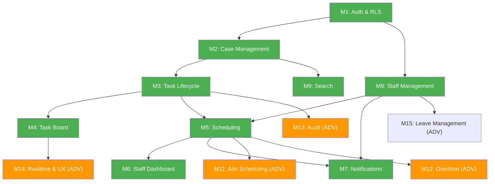

# Scope Matrix

**Project:** Team Scheduling & Task Management System  
**Version:** 1.0  
**Date:** 4 July 2026  
**Sources:**
- [SRS_v4_MVP.md](./SRS_v4_MVP.md)
- [SRS_v4_Advanced.md](./SRS_v4_Advanced.md)
- [user_stories.md](./user_stories.md)

---

## 1. Product Summary

A web application replacing an Excel-based case tracker for an immigration law firm. Two roles (Admin, Staff) manage case lifecycles, task assignment, scheduling, and notifications. Leave management is Phase 2. The product is delivered in two phases: **MVP** (operational replacement for Excel) and **Advanced** (automation, analytics, and UX enhancements).

**Delivery constraint:** All services must operate within free-tier plans during pilot.

---

## 2. Module List

| # | Module | Description | Primary Phase |
|---|--------|-------------|---------------|
| M1 | Authentication & Roles | Login, session, role routing, RLS | MVP |
| M2 | Case Management | Lead creation, acceptance, rejection, client data, dependants | MVP |
| M3 | Task Lifecycle | 13-task auto-generation (+ custom tasks), status workflow, prerequisite gates | MVP |
| M4 | Task Board | Admin tracker view (Excel replacement) | MVP + Advanced |
| M5 | Scheduling | Staff timetables, time slot assignment, conflict detection | MVP |
| M6 | Staff Dashboard & Calendar | Staff-facing daily view and priority list | MVP + Advanced |
| M7 | Notifications | In-app notification creation, delivery, read state | MVP + Advanced |
| M8 | Staff Management | Staff profiles, timetables | MVP |
| M9 | Search & Filtering | Global search, case list filters | MVP + Advanced |
| M10 | Data Integrity & Security | Soft-delete, auto-save, RLS, archive, purge | MVP |
| M11 | Advanced Scheduling & Automation | Extensions, linked cases, appointment safety net, bulk actions | Advanced |
| M12 | Overtime & Compensation | Overtime proposals, earnings, payroll reports | Advanced |
| M13 | Audit & Analytics | Change history, field-level audit log, reporting | Advanced |
| M14 | Real-Time & UX Enhancements | Realtime board, drag-and-drop, progressive alerts, psychology UX | Advanced |
| M15 | Leave Management | Leave request/approval, accrual, allowances | Advanced |

---

## 3. Feature Matrix

### M1 — Authentication & Roles

| Feature | Scope | Priority | Dependency | Complexity | Notes |
|---------|-------|----------|------------|------------|-------|
| Email/password login | MVP | Must | Supabase Auth | Low | Supabase handles auth flow |
| Role-based route protection (middleware) | MVP | Must | Login | Low | Admin vs staff routing |
| RLS policies on all tables | MVP | Must | DB schema | Medium | Core security layer — must be complete before any data access |
| Custom JWT claims (role in token) | MVP | Must | Login, DB | Low | PostgreSQL function on auth hook |
| Session persistence across tabs | MVP | Must | Login | Low | Supabase client handles this |
| Account deactivation | MVP | Must | Staff management | Low | `is_active = false` blocks all access |
| Password reset | MVP | Should | Supabase Auth | Low | Supabase built-in email flow |
| Auto-logout on inactivity | Advanced | Could | Login | Low | Client-side timer |

---

### M2 — Case Management

| Feature | Scope | Priority | Dependency | Complexity | Notes |
|---------|-------|----------|------------|------------|-------|
| Create lead (form + modal) | MVP | Must | App types | Low | Simple form → insert |
| Application type configuration (CRUD) | MVP | Must | None | Low | Admin settings page. Must exist before first case. |
| Accept lead → generate reference + 13 tasks | MVP | Must | App types, task seed data | **High** | Atomic transaction: counter UPSERT + reference + 13 inserts |
| Reject lead | MVP | Must | Create lead | Low | Status update |
| Case reference generation (MMYYSEQ/TYPE/NAME) | MVP | Must | Reference counters table | Medium | Concurrent-safe UPSERT |
| Case detail page | MVP | Must | Tasks, dependants | Medium | Multi-section page with checklist |
| Dependant management (add/edit/delete) | MVP | Should | Cases | Low | |
| Flag/unflag urgent | MVP | Must | Cases, notifications | Low | Cascades to tasks, triggers notifications |
| Case list with filters and pagination | MVP | Must | Cases | Medium | Filters: status, type, staff, urgency |
| Linked cases | Advanced | Should | Cases | Low | Self-join table |
| Case notes auto-save | MVP | Must | Auto-save hook | Low | Debounced writes |

---

### M3 — Task Lifecycle

| Feature | Scope | Priority | Dependency | Complexity | Notes |
|---------|-------|----------|------------|------------|-------|
| 13-task auto-generation on acceptance | MVP | Must | Case acceptance | Medium | Fixed seed data, batch insert |
| Custom task creation (up to 5 per case) | MVP | Must | Tasks | Low | Admin creates beyond default 13 |
| Task checklist view (ordered, status icons) | MVP | Must | Tasks | Medium | UI component with progress counter |
| Status transitions (not_started → in_progress → completed) | MVP | Must | Tasks | Medium | State machine with validation |
| Blocked status + time slot release | MVP | Must | Tasks, assignments | Medium | Multi-step: update status + release assignments |
| Unblock task | MVP | Must | Blocked flow | Low | Status revert, requires manual reschedule |
| Task 8 senior review gate (approve/revisions) | MVP | Must | Tasks, profiles (senior role) | **High** | Approval → unlock Task 9. Revisions → reopen Task 5. |
| Task 10 prerequisite check (Tasks 1, 2, 9) | MVP | Must | Tasks | Medium | Pre-completion validation |
| Task notes (inline, auto-save) | MVP | Must | Tasks, auto-save | Low | |
| Completion protection (staff cannot undo) | MVP | Must | Tasks | Low | API-level enforcement |
| Task completion triggers case completion check | MVP | Must | Tasks, cases | Medium | After each task completion, check if all 13 done |
| Task reversal (admin reopens completed) | Advanced | Should | Tasks, audit log | Low | Admin-only, logged |
| Task priority ordering (manual override) | Advanced | Could | Tasks | Low | `priority_position` column |

---

### M4 — Task Board

| Feature | Scope | Priority | Dependency | Complexity | Notes |
|---------|-------|----------|------------|------------|-------|
| Column-per-staff layout with task cards | MVP | Must | Tasks, profiles | **High** | Core Excel replacement. Most critical screen. |
| Colour-coded urgency (green/amber/red) | MVP | Must | Task board | Low | CSS-only based on task flags |
| Unassigned column | MVP | Must | Task board | Low | Tasks with `assigned_to = NULL` |
| Click card → navigate to case | MVP | Must | Task board, cases | Low | |
| Basic filters (urgent, blocked, by type) | MVP | Must | Task board | Medium | Dropdown filter |
| Blocked task visual treatment | MVP | Must | Task board | Low | Muted/striped background + icon |
| Advanced filter panel (multi-select, date range) | Advanced | Should | Task board | Medium | Full filter panel with multi-select |
| Drag-and-drop reordering | Advanced | Should | Task board | **High** | Requires react-dnd or similar, position persistence |
| Real-time live updates (Supabase Realtime) | Advanced | Should | Task board, Realtime config | **High** | Subscribe to tasks + assignments tables |
| Teal/grey row alternating colours | Advanced | Could | Task board | Low | CSS styling |
| Bulk action checkboxes + toolbar | Advanced | Should | Task board | Medium | Multi-select + batch API calls |
| Grouping by week/staff/case | Advanced | Could | Task board | Medium | Client-side grouping logic |

---

### M5 — Scheduling

| Feature | Scope | Priority | Dependency | Complexity | Notes |
|---------|-------|----------|------------|------------|-------|
| Staff timetable configuration (per-day hours) | MVP | Must | Profiles | Medium | 7-day time pair editor |
| Scheduling grid (day view, all staff) | MVP | Must | Timetables, assignments | **High** | Complex computed view: timetable − assignments = available |
| Click-to-assign from available slot | MVP | Must | Scheduling grid, assign modal | Medium | Pre-fills staff + time |
| Assign task modal (staff, date, time, duration) | MVP | Must | Tasks, timetables | **High** | Conflict detection, schedule preview, validation |
| Double-booking prevention (exclusion constraint) | MVP | Must | Task assignments table | Medium | Database-level constraint + API check |
| Leave blocking on schedule | Advanced | Must | M15 Leave requests, schedule | Medium | JOIN approved leave into grid — see [ADR-0001](./adr/0001-leave-management-deferred-to-phase-2.md) |
| Blocked task pool (admin consolidated view) | MVP | Must | Tasks (blocked status) | Low | Filtered table view |
| Outside-working-hours warning | MVP | Should | Timetables, assign modal | Low | Warning only in MVP |
| Overtime detection + proposal flow | Advanced | Should | Timetables, overtime table | Medium | Warning → modal → staff accept/reject |

---

### M6 — Staff Dashboard & Calendar

| Feature | Scope | Priority | Dependency | Complexity | Notes |
|---------|-------|----------|------------|------------|-------|
| Staff dashboard with priority list | MVP | Must | Tasks, assignments | Medium | Server-side priority sorting algorithm |
| "Next Action" highlighted card | MVP | Must | Dashboard | Low | First item styling |
| Summary cards (today, overdue, blocked, week) | MVP | Must | Dashboard | Low | Aggregate queries |
| Staff day calendar (hour-by-hour) | MVP | Must | Assignments, timetables | Medium | Similar to scheduling grid but single-staff |
| Current time marker | MVP | Should | Calendar | Low | Client-side positioning |
| Online status toggle | MVP | Should | Profiles | Low | Dropdown, DB update |
| Staff week view calendar | Advanced | Should | Calendar | Medium | 5-column grid |
| Staff month/quarter overview | Advanced | Could | Calendar | Medium | Calendar widget with dot indicators |

---

### M7 — Notifications

| Feature | Scope | Priority | Dependency | Complexity | Notes |
|---------|-------|----------|------------|------------|-------|
| Notification creation on task assignment | MVP | Must | Task assignment | Low | INSERT into notifications table |
| Notification creation on urgent flag | MVP | Must | Urgent toggle | Low | One per assigned staff |
| Notification on leave approval/rejection | Advanced | Must | M15 Leave workflow | Low | Phase 2 — see [ADR-0001](./adr/0001-leave-management-deferred-to-phase-2.md) |
| Notification on task blocked | MVP | Must | Block workflow | Low | |
| Notification drawer (slide-out panel) | MVP | Must | Notifications table | Medium | UI: tabs, unread badge, mark read |
| Mark read / mark all read | MVP | Must | Notifications | Low | |
| Bell icon with unread count badge | MVP | Must | Notifications | Low | Client-side computed count |
| Real-time notification delivery (Supabase Realtime) | MVP | Must | Realtime config | Medium | Subscribe to INSERT on notifications table |
| Overdue task detection + notification (cron) | MVP | Must | Edge function, tasks | Medium | Scheduled function, must not duplicate |
| Document upload approaching alert (3 working days + escalation) | MVP | Must | Edge function, Tasks 11–13 | Medium | See US-7.7, [ADR-0007](./adr/0007-hybrid-amber-and-du-escalation.md) |
| Progressive alert escalation (14d, 7d, 3d, 1d) | Advanced | Should | Edge function, appointments | Medium | Multiple escalation tiers |
| Blocked task reminder (>48h) | Advanced | Should | Edge function, tasks | Low | Daily cron check |
| Deadline approaching warning (1h, 30min) | Advanced | Could | Edge function | Low | More frequent cron |
| SMS / email notifications | Future | Could | Third-party service | Medium | Explicitly deferred by user |

---

### M8 — Staff Management

| Feature | Scope | Priority | Dependency | Complexity | Notes |
|---------|-------|----------|------------|------------|-------|
| Create staff member (+ auth account) | MVP | Must | Supabase Auth admin API | Medium | Service-role key creates auth user |
| Staff list with status and counts | MVP | Must | Profiles, tasks | Low | |
| Activate/deactivate staff | MVP | Must | Profiles | Low | Blocks login via RLS |
| Team overview page | MVP | Should | Profiles, tasks | Low | Read-only summary |
| Staff profile deep-dive (admin) | Advanced | Should | Profiles, tasks, overtime | Medium | Aggregated stats page |

---

### M9 — Search & Filtering

| Feature | Scope | Priority | Dependency | Complexity | Notes |
|---------|-------|----------|------------|------------|-------|
| Global search bar (reference + client name) | MVP | Must | Cases, pg_trgm extension | Medium | Fuzzy search with trigram index |
| Search dropdown with results (debounced) | MVP | Must | Search API | Medium | 300ms debounce, max 8 results |
| Staff restriction on search results | MVP | Must | RLS, search | Low | RLS handles filtering |
| Case list column sorting | MVP | Must | Case list | Low | Client-side or query param |
| Advanced search (multi-field, date range) | Advanced | Should | Search | Medium | Extended filter panel |
| Admin weekly/monthly team calendar | Advanced | Could | Schedule | Medium | Cross-staff calendar view |

---

### M10 — Data Integrity & Security

| Feature | Scope | Priority | Dependency | Complexity | Notes |
|---------|-------|----------|------------|------------|-------|
| Soft-delete on cases, tasks, dependants | MVP | Must | DB schema | Low | `is_deleted` + `deleted_at` columns |
| Archive page (view deleted records) | MVP | Must | Soft-delete | Low | Filtered query |
| Restore from archive | MVP | Must | Soft-delete | Low | Clear delete flags |
| Purge expired records (hard-delete) | MVP | Should | Archive | Medium | Cascading deletes, confirmation UI |
| Auto-save with visual indicator | MVP | Must | Custom hook | Medium | Debounce + optimistic UI + rollback |
| Immutability rules (last_date, appointment_date, reference) | MVP | Must | Cases | Low | API + trigger enforcement |
| `updated_at` auto-trigger on all tables | MVP | Must | DB triggers | Low | Single reusable trigger function |
| Profile auto-creation on auth signup | MVP | Must | DB trigger | Low | Trigger on auth.users INSERT |
| RLS enforcement (all tables) | MVP | Must | DB policies | **High** | ~15 policies across 11 tables, exhaustive testing required |
| Security headers (CSP, X-Frame, etc.) | MVP | Must | next.config.js | Low | One-time configuration |
| Full audit log (field-level change history) | Advanced | Should | DB triggers, audit_log table | **High** | Trigger on every UPDATE for tracked tables |
| Change history drawer UI | Advanced | Should | Audit log | Medium | Timeline view of changes |

---

### M11 — Advanced Scheduling & Automation

| Feature | Scope | Priority | Dependency | Complexity | Notes |
|---------|-------|----------|------------|------------|-------|
| Task time extension request (staff) | Advanced | Should | Tasks, extensions table | Medium | Request + approve/deny workflow |
| Extension approval + schedule adjustment | Advanced | Should | Extensions, assignments | **High** | Shifts subsequent assignments |
| Pending cases pool (unassigned tasks view) | Advanced | Should | Tasks | Low | Filtered table |
| Appointment safety net dashboard | Advanced | Should | Tasks (11, 12, 13), appointments | Medium | Countdown + prerequisite checks |
| Pre-appointment confirmation checklist | Advanced | Should | Safety net | Low | Modal with checkbox validation |
| Auto-schedule document upload (Task 13) | Advanced | Could | Edge function, Task 11 | Medium | Triggered by appointment date set |
| Bulk task assignment | Advanced | Should | Tasks, assignments | Medium | Multi-select + batch assign |

---

### M12 — Overtime & Compensation

| Feature | Scope | Priority | Dependency | Complexity | Notes |
|---------|-------|----------|------------|------------|-------|
| Overtime detection (outside working hours) | Advanced | Should | Timetables, assignments | Medium | Comparison function |
| Overtime compensation proposal (admin) | Advanced | Should | Overtime table | Medium | Fixed or hourly rate |
| Staff accept/reject overtime | Advanced | Should | Overtime proposals | Low | Notification + response |
| Staff earnings dashboard | Advanced | Should | Overtime accepted records | Medium | Monthly aggregation |
| Monthly overtime report (admin) | Advanced | Should | Overtime records | Medium | Per-staff summary table |
| CSV export of overtime report | Advanced | Could | Report | Low | Server-side CSV generation |

---

### M13 — Audit & Analytics

| Feature | Scope | Priority | Dependency | Complexity | Notes |
|---------|-------|----------|------------|------------|-------|
| Audit log table + triggers | Advanced | Should | DB triggers | **High** | Per-field change tracking |
| Change history UI (drawer) | Advanced | Should | Audit log | Medium | Chronological timeline |
| Blocked task analytics | Advanced | Could | Tasks (blocked) | Low | Aggregate stats |
| Extension analytics | Advanced | Could | Extensions | Low | Aggregate stats |
| Task completion time analytics | Advanced | Could | Tasks (completed_at - created_at) | Low | |

---

### M14 — Real-Time & UX Enhancements

| Feature | Scope | Priority | Dependency | Complexity | Notes |
|---------|-------|----------|------------|------------|-------|
| Realtime task board updates | Advanced | Should | Supabase Realtime, task board | **High** | Subscribe + reconcile + optimistic UI |
| Drag-and-drop task reordering | Advanced | Should | Task board | **High** | Requires library + position persistence |
| Progressive alert escalation | Advanced | Should | Edge functions, notifications | Medium | Multi-tier cron logic |
| Psychology-driven UX (colour, urgency cues) | Advanced | Could | All UI | Low | Design-level work |
| Keyboard shortcuts | Advanced | Could | All pages | Medium | Event listeners + help dialog |
| Dark mode | Future | Could | CSS | Medium | Theme system |

---

## 4. Summary Counts

| Scope | Must | Should | Could | Total |
|-------|:----:|:------:|:-----:|:-----:|
| **MVP** | 47 | 8 | 0 | **55** |
| **Advanced** | 5 | 26 | 10 | **41** |
| **Future** | 0 | 0 | 4 | **4** |
| **Total** | **52** | **34** | **14** | **100** |

---

## 5. Dependency Graph

**Legend:** 🟩 Green = MVP · 🟧 Orange = Advanced

**Critical path:** M1 → M2 → M3 → M5 → M4 (this sequence must be built in order)

---

## 6. Risks

| # | Risk | Likelihood | Impact | Mitigation |
|---|------|-----------|--------|------------|
| R1 | **Case acceptance transaction is the most complex single operation** (reference + 13 task inserts). If it fails partially, data corruption occurs. | Medium | Critical | Wrap in database transaction. Integration test for rollback (TC-023). |
| R2 | **RLS policy errors can leak data between staff members.** Policies are numerous (~15) and hard to test exhaustively. | Medium | Critical | Dedicated security test suite (TC-097–100). Principle: deny by default, whitelist access. |
| R3 | **Scheduling grid is the densest UI.** Computing available slots from timetables − assignments is complex. Performance may degrade with many staff/tasks. | Medium | High | Server-side computation (EP-24). Cache aggressively. Limit to day view in MVP. Leave blocking adds complexity in Phase 2. |
| R4 | **Task 8 senior review gate creates a dependency chain.** If the senior reviewer is unavailable, the entire case stalls at task 8. | High | Medium | Allow admin to bypass/override the gate. Document as a known workflow constraint. |
| R5 | **Free-tier Supabase limits are untested at scale.** We estimate 10× headroom, but real-world patterns may differ. | Low | High | Monitor usage metrics weekly. Have Supabase Pro upgrade plan ready (< 1 hour to switch). |
| R6 | **Single admin bottleneck.** If only one admin exists, every operation (case creation, assignment, approval) depends on one person. | Medium | Medium | System should support multiple admins. SRS does not restrict admin count. |
| R7 | **Task prerequisite logic (Task 10 requiring Tasks 1, 2, 9) is hardcoded.** If the firm changes its 13-task lifecycle, code must change. | Low | Medium | Isolate prerequisite rules in a single utility function. Document clearly. Consider config-driven rules in Advanced. |
| R8 | **Drag-and-drop (Advanced) is one of the highest-complexity features** and often has accessibility, mobile, and performance issues. | High | Low (Advanced only) | Defer until MVP is stable. Evaluate libraries (dnd-kit vs react-dnd) before committing. |

---

## 7. Phased Delivery Plan

### Phase 1 — MVP (Sprints 1–8)

#### Sprint 1–2: Foundation

| Module | Features | Deliverable |
|--------|----------|-------------|
| M1 | Login, role routing, RLS policies, middleware | Auth works. Admin/staff see different dashboards. |
| M10 (partial) | `updated_at` triggers, profile auto-creation, security headers | Database triggers active. |
| — | Project scaffolding, Supabase setup, CI/CD pipeline | Infrastructure operational. |

#### Sprint 3–4: Case Core

| Module | Features | Deliverable |
|--------|----------|-------------|
| M2 | App type config, create lead, accept/reject, reference generation, case list, case detail | Full case lifecycle: lead → active → visible. |
| M3 | 13-task auto-generation, checklist view, status transitions, prerequisite gates, Task 8 gate | Tasks work end-to-end. |

#### Sprint 5–6: Scheduling & Assignment

| Module | Features | Deliverable |
|--------|----------|-------------|
| M5 | Staff timetables, scheduling grid, assign task modal, conflict detection | Admin can schedule tasks. |
| M8 | Create staff, staff list | Staff management functional. |

#### Sprint 7–8: Dashboards, Notifications & Polish

| Module | Features | Deliverable |
|--------|----------|-------------|
| M4 | Task board (column layout, cards, colour coding, filters) | Excel replacement live. |
| M6 | Staff dashboard, priority list, day calendar | Staff have their work view. |
| M7 | Notification creation, drawer, bell badge, realtime delivery, overdue cron | Notifications operational. |
| M9 | Global search, case list sorting | Search works. |
| M10 | Soft-delete, archive, restore, purge, auto-save | Data integrity complete. |

**MVP Exit Criteria:** Full lifecycle test (TC-E2E-001) passes. All P1 tests pass. UAT sign-off.

---

### Phase 2 — Advanced (Sprints 9–14)

#### Sprint 9–10: Board Enhancements

| Module | Features |
|--------|----------|
| M14 | Realtime task board updates, drag-and-drop reordering |
| M4 | Advanced filters, bulk actions, grouping |

#### Sprint 11–12: Scheduling Extensions

| Module | Features |
|--------|----------|
| M11 | Task extension workflow, appointment safety net, pre-appointment confirmation |
| M6 | Week view, month view calendars |

#### Sprint 13–14: Overtime & Audit

| Module | Features |
|--------|----------|
| M12 | Overtime detection, proposals, earnings, reports, CSV export |
| M13 | Audit log triggers, change history UI |
| M7 | Progressive alerts, blocked reminders |
| M15 | Leave allowance config, request submission, approval flow |

---

### Phase 3 — Future (Unscheduled)

| Feature | Trigger to Build |
|---------|-----------------|
| SMS / email notifications | When in-app notifications prove insufficient |
| Half-day leave (M15) | When firm requests it |
| Public holiday calendar (M15) | When manual leave entries become burdensome |
| Dark mode | When user base requests it |
| Config-driven task lifecycle | When firm needs different task lists per application type |

---

## 8. Complexity Heat Map

| Module | Effort | Risk | Why |
|--------|:------:|:----:|-----|
| M1 Auth & RLS | 🟡 Medium | 🔴 High | RLS policies are the security foundation — errors leak data |
| M2 Case Management | 🟡 Medium | 🟡 Medium | Acceptance transaction is complex but isolated |
| M3 Task Lifecycle | 🟡 Medium | 🟡 Medium | Prerequisite gates require careful state machine design |
| M4 Task Board | 🔴 High | 🟡 Medium | Most complex UI. Must handle density, colour, filtering. |
| M5 Scheduling | 🔴 High | 🔴 High | Conflict detection + timetable + available slot calculation |
| M6 Staff Dashboard | 🟢 Low | 🟢 Low | Straightforward read-only views |
| M7 Notifications | 🟡 Medium | 🟡 Medium | Realtime delivery adds complexity |
| M8 Staff | 🟢 Low | 🟢 Low | Simple CRUD |
| M9 Search | 🟢 Low | 🟢 Low | pg_trgm handles heavy lifting |
| M10 Data Integrity | 🟢 Low | 🟢 Low | Standard patterns (soft-delete, auto-save) |
| M11 Adv Scheduling | 🟡 Medium | 🟡 Medium | Extension flow impacts schedule |
| M12 Overtime | 🟡 Medium | 🟢 Low | Mostly CRUD + aggregation |
| M13 Audit | 🔴 High | 🟢 Low | Trigger complexity but low business risk |
| M14 Realtime & UX | 🔴 High | 🟡 Medium | Realtime + drag-and-drop are the highest-effort items |
| M15 Leave Mgmt | 🟡 Medium | 🟡 Medium | Accrual calculation and over-limit logic |

---

## 9. Open Questions

| # | Question | Impact | Status |
|---|----------|--------|--------|
| SQ-1 | **Should the 13-task lifecycle be configurable per application type?** | M3 architecture, seeding logic | **Resolved** — Fixed for MVP. See [ADR-0002](./adr/0002-fixed-13-task-lifecycle-for-mvp.md). |
| SQ-2 | **Should sprint length be 1 week or 2 weeks?** | Delivery timeline | **Resolved** — 2-week sprints. See [ADR-0005](./adr/0005-delivery-assumptions.md). |
| SQ-3 | **Is the team size 1 developer or more?** | Sprint capacity | **Resolved** — Plan for 1 developer. See [ADR-0005](./adr/0005-delivery-assumptions.md). |
| SQ-4 | **Should RLS testing block Sprint 1 completion?** | Sprint 1 scope | **Resolved** — Incremental RLS per table. See [ADR-0005](./adr/0005-delivery-assumptions.md). |
| SQ-5 | **What is the firm's UAT availability?** | Release cadence | **Resolved** — Target staging demo every 2 sprints. Confirm cadence with firm at Sprint 1 kickoff. |

---

*— End of Document —*
