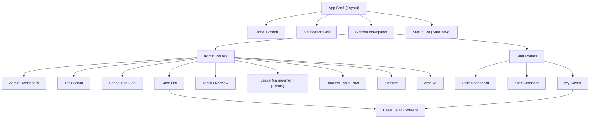
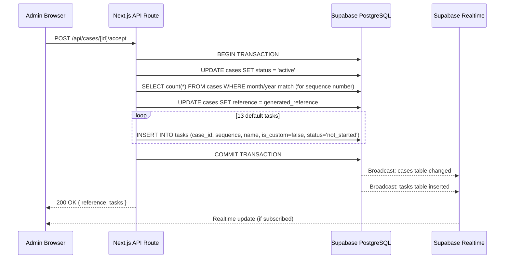
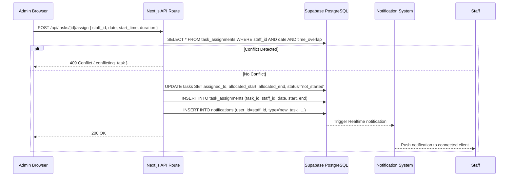
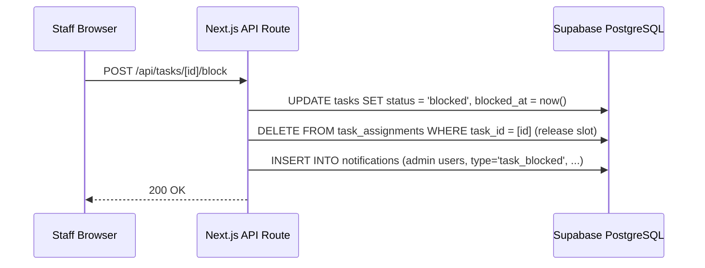
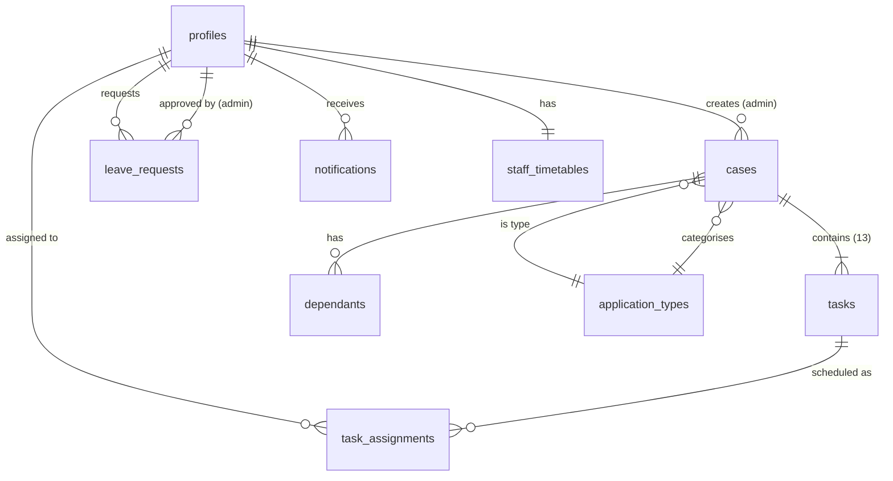

# System Design Document

**Project:** Team Scheduling & Task Management System  
**Version:** 1.0  
**Date:** 4 July 2026  
**Sources:**
- [SRS_v4_MVP.md](./SRS_v4_MVP.md)
- [SRS_v4_Advanced.md](./SRS_v4_Advanced.md)
- [user_stories.md](./user_stories.md)
- [ui_wireframe_spec.md](./ui_wireframe_spec.md)

---

## 1. Overview

This document defines the technical architecture for a team scheduling and task management system that replaces an Excel-based tracker used by an immigration law firm. The system manages case lifecycles, staff scheduling, task assignment, leave, and notifications for two user roles — Administrator and Staff.

**Key Architectural Constraints:**
- Single-tenant deployment (one firm)
- All services must operate within free-tier plans during pilot
- No document storage — documents live externally (Google Docs, email, shared drives)
- BYOD environment — staff access from personal devices across multiple countries (UK, India)
- Data minimisation — collect only what is operationally necessary

---

## 2. System Goals

| Goal | Metric |
|------|--------|
| Replace Excel tracker with zero data loss | All Excel fields represented; soft-delete on all records |
| Sub-3-second page loads for primary views | Task board, scheduling grid, dashboards load within 3s for 100 tasks |
| Support 10–20 concurrent users | Free-tier infrastructure handles full team |
| Enforce role-based data isolation | Staff cannot access other staff's data or admin views |
| Mobile-functional for BYOD staff | Responsive design, minimum 375px viewport |
| Auto-save all edits | No data lost to browser crashes, navigation, or timeouts |
| Enable admin-controlled scheduling | Conflict prevention, timetable enforcement, leave blocking |

---

## 3. Architecture Summary

### 3.1 High-Level Architecture

```
┌─────────────────────────────────────────────────────────────┐
│                        CLIENT TIER                          │
│                                                             │
│  ┌──────────────────────────────────────────────────────┐   │
│  │            Next.js Frontend (App Router)             │   │
│  │   React Server Components + Client Components        │   │
│  │   Tailwind CSS · Framer Motion                       │   │
│  └──────────────┬───────────────────────┬───────────────┘   │
│                 │                       │                    │
│           API Routes              Supabase Client           │
│          (Server-side)            (Client-side)             │
└─────────────────┼───────────────────────┼───────────────────┘
                  │                       │
┌─────────────────┼───────────────────────┼───────────────────┐
│                 │   PLATFORM TIER       │                    │
│  ┌──────────────▼───────────────────────▼───────────────┐   │
│  │                   Supabase                           │   │
│  │                                                       │   │
│  │  ┌─────────┐ ┌──────────┐ ┌──────────┐ ┌──────────┐ │   │
│  │  │  Auth   │ │PostgreSQL│ │ Realtime │ │  Edge    │ │   │
│  │  │         │ │  + RLS   │ │(Pub/Sub) │ │Functions │ │   │
│  │  └─────────┘ └──────────┘ └──────────┘ └──────────┘ │   │
│  └──────────────────────────────────────────────────────┘   │
│                                                             │
└─────────────────────────────────────────────────────────────┘
                  │
┌─────────────────┼───────────────────────────────────────────┐
│                 │   HOSTING TIER                             │
│  ┌──────────────▼──────────────────────────────────────┐    │
│  │                    Vercel                            │    │
│  │   Serverless Functions · Edge Network · CI/CD       │    │
│  └─────────────────────────────────────────────────────┘    │
└─────────────────────────────────────────────────────────────┘
```

### 3.2 Architectural Style

**Monolithic frontend + BaaS (Backend-as-a-Service)**

The system uses Next.js as a full-stack monolith that communicates directly with Supabase. There is no custom backend server. Business logic lives in three locations:

| Location | Responsibility |
|----------|----------------|
| **Next.js API Routes** | Complex business logic requiring multi-step transactions (case acceptance + reference generation + task creation). Server-side validation. |
| **Supabase RLS Policies** | Access control enforcement. Every data query is filtered by role and user at the database level. |
| **Supabase Edge Functions** | Scheduled jobs (overdue detection, notification triggers). Lightweight event-driven logic. |

### 3.3 Why This Architecture

| Decision | Rationale | Alternatives Considered |
|----------|-----------|------------------------|
| Next.js monolith (no separate backend) | Single deployment, single codebase, free Vercel hosting. Team size and complexity do not justify a separate API layer. | Express API + React SPA — rejected for infrastructure overhead |
| Supabase over Firebase | PostgreSQL supports relational data model (cases → tasks → assignments). RLS provides row-level security without middleware. | Firebase — rejected due to NoSQL impedance mismatch with highly relational data |
| RLS over middleware auth | Security enforced at database level, not application level. Even if frontend code has bugs, data access is restricted. | Application-level auth only — rejected as insufficient for BYOD/remote teams |
| Vercel over self-hosted | Zero-configuration deployment for Next.js. Free tier sufficient for pilot. | AWS/Docker — rejected for operational overhead at this stage |

---

## 4. Component Breakdown

### 4.1 Frontend Components



### 4.2 Frontend Rendering Strategy

| Route / Page | Rendering | Reason |
|-------------|-----------|--------|
| Login | SSR (Server) | SEO not needed, but server-side auth check on load |
| Admin Dashboard | SSR + Client hydration | Initial data fetched server-side for fast first paint; summary cards update client-side |
| Task Board | Client-side | Highly interactive, frequent updates, benefits from client-side state management |
| Scheduling Grid | Client-side | Drag-to-assign interaction, real-time slot availability |
| Case Detail | SSR + Client hydration | Static case data SSR; task status updates via client-side mutations |
| Case List | SSR with pagination | Server-side filtering and sorting for performance |
| Staff Dashboard | SSR + Client hydration | Priority list computed server-side; notifications stream client-side |
| Notification Centre | Client-side | Streams via Supabase Realtime |

### 4.3 State Management

| State Type | Tool | Scope |
|-----------|------|-------|
| Server state (cases, tasks, staff) | React Query (TanStack Query) | Global — cached, deduplicated, background-refreshed |
| Auth state | Supabase Auth context | Global — `useSession()` hook |
| UI state (modals, drawers, filters) | React `useState` / `useReducer` | Component-local |
| Real-time subscriptions | Supabase Realtime channels | Page-scoped — subscribe on mount, unsubscribe on unmount |
| Auto-save state | Custom `useAutoSave` hook | Per-form — debounced writes with optimistic UI |
| Notification state | React Query + Supabase Realtime | Global — query for initial load, subscribe for new |

### 4.4 API Routes (Next.js Server-Side)

API routes handle operations that require multi-step transactions, server-side validation, or business logic that should not run on the client.

| Route | Method | Purpose | MVP/Adv |
|-------|--------|---------|---------|
| `/api/cases` | POST | Create a new lead | MVP |
| `/api/cases/[id]/accept` | POST | Accept lead → generate reference → create 13 tasks (transaction) | MVP |
| `/api/cases/[id]/reject` | POST | Reject lead | MVP |
| `/api/cases/[id]/urgent` | POST | Toggle urgent flag → trigger notifications | MVP |
| `/api/tasks/[id]/status` | PATCH | Update task status with gate validation (Task 10 prerequisites, Task 8 approval) | MVP |
| `/api/tasks/[id]/assign` | POST | Assign task to staff + time slot with conflict detection | MVP |
| `/api/tasks/[id]/block` | POST | Mark blocked → release time slot | MVP |
| `/api/tasks/[id]/unblock` | POST | Unblock task | MVP |
| `/api/staff` | POST | Create staff member + Supabase Auth account | MVP |
| `/api/staff/[id]/timetable` | PUT | Update staff timetable | MVP |
| `/api/leave` | POST | Submit leave request | Advanced |
| `/api/leave/[id]/approve` | POST | Approve leave → block schedule slots | Advanced |
| `/api/leave/[id]/reject` | POST | Reject leave → notify staff | Advanced |
| `/api/references/generate` | POST | Generate case reference (called by accept flow) | MVP |
| `/api/notifications/mark-read` | POST | Mark notification(s) as read | MVP |
| `/api/tasks/[id]/extend` | POST | Request time extension | Advanced |
| `/api/tasks/[id]/extend/[reqId]/approve` | POST | Approve/deny extension → adjust schedule | Advanced |
| `/api/overtime/[id]/propose` | POST | Attach compensation proposal to overtime task | Advanced |
| `/api/overtime/[id]/respond` | POST | Staff accept/reject overtime proposal | Advanced |
| `/api/reports/overtime` | GET | Generate monthly overtime report | Advanced |
| `/api/reports/export` | GET | CSV export of reports | Advanced |

**Direct Supabase Client Reads (no API route needed):**

All read operations use the Supabase **browser client** (initialised with the anon key) directly from the frontend, protected by RLS:

- Fetching case list, case detail, task lists, checklist data
- Fetching staff schedules, timetables, online status
- Fetching leave requests, leave allowances
- Fetching notifications
- Fetching archived records (admin only — RLS enforces access)
- Search queries

> **Mandatory Client Factory Pattern (C-02):** The codebase MUST use two separate Supabase client factories. The service role key must NEVER be accessible from client-side code.
>
> ```typescript
> // lib/supabase/browser.ts — used in client components and direct reads
> import { createBrowserClient } from '@supabase/ssr';
> export const createClient = () =>
>   createBrowserClient(
>     process.env.NEXT_PUBLIC_SUPABASE_URL!,
>     process.env.NEXT_PUBLIC_SUPABASE_ANON_KEY!
>   );
>
> // lib/supabase/server.ts — used ONLY in API routes / server actions
> import { createServerClient } from '@supabase/ssr';
> export const createServiceClient = () =>
>   createClient(
>     process.env.NEXT_PUBLIC_SUPABASE_URL!,
>     process.env.SUPABASE_SERVICE_ROLE_KEY!,  // server-only, bypasses RLS
>     { auth: { persistSession: false } }
>   );
> ```
>
> **Enforcement rules:**
> 1. `SUPABASE_SERVICE_ROLE_KEY` has NO `NEXT_PUBLIC_` prefix — Next.js will never bundle it into client code.
> 2. A CI lint rule (`grep -r 'SERVICE_ROLE' src/app/ src/components/`) must fail if the key is referenced in any client-side file.
> 3. The service client is used ONLY for: notification insertion, admin user management, and cron functions.
> 4. Never return the service client instance or its internals in any API response.

### 4.5 Supabase Edge Functions

| Function | Trigger | Purpose | MVP/Adv |
|----------|---------|---------|---------|
| `detect-overdue` | Cron (every 15 min) | Scan tasks with non-released assignments where `date + end_time < now()` and status ≠ Completed/Blocked → set `is_overdue = true`, create notification. **Note:** The `is_overdue` flag is a cached hint for notifications only. The UI computes overdue status on-read by comparing `assignment.date + assignment.end_time` with `now()` for real-time accuracy (no 15-min lag). | MVP |
| `cleanup-notifications` | Cron (daily at 02:00) | Delete read notifications older than 90 days. Skip unread and unacknowledged urgent notifications. | MVP |
| `auto-schedule-upload` | Database webhook (Task 11 appointment_date updated) | Calculate 3 working days before appointment → schedule Task 13 | Advanced |
| `escalation-alerts` | Cron (daily at 09:00) | Check appointment countdowns → generate progressive alerts (14d, 7d, 3d, 1d, morning) | Advanced |
| `blocked-reminders` | Cron (daily at 09:00) | Check tasks blocked > 48h → send reminder notifications | Advanced |
| `deadline-warnings` | Cron (every 30 min) | Check tasks with deadline in 1h or 30min → send approaching-deadline notifications | Advanced |

---

## 5. Data Flow

### 5.1 Case Acceptance Flow (Most Complex MVP Transaction)



### 5.2 Task Assignment Flow



### 5.3 Blocked Task Flow



### 5.4 Notification Delivery Flow

```
                          ┌────────────────┐
                          │ Trigger Event  │
                          │ (task assigned,│
                          │  case urgent,  │
                          │  task overdue) │
                          └───────┬────────┘
                                  │
                    ┌─────────────▼─────────────┐
                    │  INSERT INTO notifications │
                    │  (user_id, type, payload)  │
                    └─────────────┬─────────────┘
                                  │
                    ┌─────────────▼─────────────┐
                    │  Supabase Realtime         │
                    │  broadcasts to channel:    │
                    │  notifications:{user_id}   │
                    └─────────────┬─────────────┘
                                  │
                    ┌─────────────▼─────────────┐
                    │  Client Supabase listener  │
                    │  receives event →          │
                    │  updates notification state│
                    │  → badge count increments  │
                    │  → toast displayed          │
                    └───────────────────────────┘
```

### 5.5 Auto-Save Flow

```
User types in field
    │
    ▼
Debounce (1 second after last keystroke)
    │
    ▼
Supabase client: UPDATE table SET field = value
    │
    ├── Success → UI shows "Saved ✓" (green, fades after 2s)
    │
    └── Failure → UI shows "⚠ Not saved" (persistent red banner)
                  Retry after 5s, 15s, 30s (exponential backoff)
                  If still failing → "Check your connection"
```

---

## 6. Database Design

### 6.1 Entity Relationship Overview



> **Naming:** The database table is `profiles` (extends `auth.users`). All references in this document use `profiles` for consistency with the database schema document.
>
> **Removed:** `task_status_log` and `staff_profiles` — these do not exist in the database schema. Task status history is handled by the `audit_log` table (Advanced phase). The `senior` role is a sub-role of `staff` stored as a value in the `user_role` enum on `profiles`, not a separate table.

### 6.2 Table Definitions

#### `profiles` (extends Supabase auth.users)

| Column | Type | Constraints | Notes |
|--------|------|------------|-------|
| id | uuid | PK, FK → auth.users.id | Supabase managed |
| full_name | text | NOT NULL | |
| email | text | NOT NULL, UNIQUE | |
| role | enum('admin','staff','senior') | NOT NULL | `senior` is a staff sub-role — treated identically to `staff` by RLS. The distinction only affects Task 8 (Senior Review) assignment eligibility. |
| is_active | boolean | NOT NULL, DEFAULT true | Deactivation flag. When set to `false`, the API route must also call `supabase.auth.admin.updateUserById(id, { banned: true })` to immediately invalidate sessions. |
| online_status | enum('online','break','offline') | DEFAULT 'offline' | |
| created_at | timestamptz | DEFAULT now() | |
| updated_at | timestamptz | DEFAULT now() | |

#### `application_types`

| Column | Type | Constraints | Notes |
|--------|------|------------|-------|
| id | uuid | PK | |
| name | text | NOT NULL, UNIQUE | e.g., "Skilled Worker Visa" |
| code | varchar(3) | NOT NULL, UNIQUE | e.g., "SKW" — used in reference generation |
| is_active | boolean | NOT NULL, DEFAULT true | |
| created_at | timestamptz | DEFAULT now() | |

#### `cases`

| Column | Type | Constraints | Notes |
|--------|------|------------|-------|
| id | uuid | PK | |
| reference | text | UNIQUE, NULLABLE | Generated on acceptance. NULL for leads. |
| client_first_name | text | NOT NULL | |
| client_last_name | text | NOT NULL | |
| application_type_id | uuid | FK → application_types.id, NOT NULL | |
| status | enum('lead_pending','active','rejected','completed') | NOT NULL, DEFAULT 'lead_pending' | |
| is_urgent | boolean | NOT NULL, DEFAULT false | |
| last_date | date | NULLABLE | Visa expiry / absolute deadline |
| appointment_date | timestamptz | NULLABLE | Set when Task 11 is completed |
| notes | text | NULLABLE | General case notes |
| created_by | uuid | FK → users.id | Admin who created the lead |
| accepted_at | timestamptz | NULLABLE | |
| is_deleted | boolean | NOT NULL, DEFAULT false | Soft-delete |
| deleted_at | timestamptz | NULLABLE | |
| created_at | timestamptz | DEFAULT now() | |
| updated_at | timestamptz | DEFAULT now() | |

#### `dependants`

| Column | Type | Constraints | Notes |
|--------|------|------------|-------|
| id | uuid | PK | |
| case_id | uuid | FK → cases.id, NOT NULL | |
| name | text | NOT NULL | |
| relationship | text | NOT NULL | e.g., "spouse", "child" |
| is_deleted | boolean | NOT NULL, DEFAULT false | |
| created_at | timestamptz | DEFAULT now() | |

#### `tasks`

| Column | Type | Constraints | Notes |
|--------|------|------------|-------|
| id | uuid | PK | |
| case_id | uuid | FK → cases.id, NOT NULL | |
| sequence | integer | NOT NULL, CHECK >= 1 | Task order in lifecycle (1-13 default, 14+ custom) |
| name | text | NOT NULL | e.g., "CCL (Client Care Letter)" |
| abbreviation | varchar(20) | NOT NULL | e.g., "CCL", "App", "DU" |
| description | text | | |
| status | enum('not_started','in_progress','completed','blocked') | NOT NULL, DEFAULT 'not_started' | |
| is_overdue | boolean | NOT NULL, DEFAULT false | Set by `detect-overdue` cron |
| assigned_to | uuid | FK → users.id, NULLABLE | NULL until assigned |
| notes | text | NULLABLE | Inline notes (freeform) |
| blocked_at | timestamptz | NULLABLE | When task was blocked |
| completed_at | timestamptz | NULLABLE | |
| completed_by | uuid | FK → users.id, NULLABLE | |
| senior_approval | enum('pending','approved','revisions_required') | NULLABLE | Only for Task 8 |
| is_custom | boolean | NOT NULL, DEFAULT false | Distinguishes custom tasks |
| priority_position | integer | NULLABLE | Manual override position (Advanced) |
| is_overtime | boolean | NOT NULL, DEFAULT false | Advanced |
| is_deleted | boolean | NOT NULL, DEFAULT false | |
| deleted_at | timestamptz | NULLABLE | |
| created_at | timestamptz | DEFAULT now() | |
| updated_at | timestamptz | DEFAULT now() | |

#### `task_assignments` (schedule slots)

| Column | Type | Constraints | Notes |
|--------|------|------------|-------|
| id | uuid | PK | |
| task_id | uuid | FK → tasks.id, NOT NULL | |
| staff_id | uuid | FK → users.id, NOT NULL | |
| date | date | NOT NULL | Scheduled date |
| start_time | time | NOT NULL | e.g., 11:00 |
| end_time | time | NOT NULL | e.g., 13:00 |
| is_released | boolean | NOT NULL, DEFAULT false | True when task is blocked (slot freed) |
| created_at | timestamptz | DEFAULT now() | |

**Conflict prevention:** A database constraint or trigger ensures no two non-released assignments for the same `staff_id` on the same `date` have overlapping `start_time`/`end_time` ranges.

#### `staff_timetables`

| Column | Type | Constraints | Notes |
|--------|------|------------|-------|
| id | uuid | PK | |
| staff_id | uuid | FK → users.id, NOT NULL, UNIQUE | One timetable per staff member |
| monday_start | time | NULLABLE | NULL = non-working day |
| monday_end | time | NULLABLE | |
| tuesday_start | time | NULLABLE | |
| tuesday_end | time | NULLABLE | |
| wednesday_start | time | NULLABLE | |
| wednesday_end | time | NULLABLE | |
| thursday_start | time | NULLABLE | |
| thursday_end | time | NULLABLE | |
| friday_start | time | NULLABLE | |
| friday_end | time | NULLABLE | |
| saturday_start | time | NULLABLE | |
| saturday_end | time | NULLABLE | |
| sunday_start | time | NULLABLE | |
| sunday_end | time | NULLABLE | |
| updated_at | timestamptz | DEFAULT now() | |

#### `notifications`

| Column | Type | Constraints | Notes |
|--------|------|------------|-------|
| id | uuid | PK | |
| user_id | uuid | FK → users.id, NOT NULL | Recipient |
| type | enum('new_task','urgent','overdue','task_blocked','leave_approved','leave_rejected','extension_request','extension_response','overtime_proposal','overtime_response','deadline_warning','blocked_reminder','appointment_alert') | NOT NULL | |
| title | text | NOT NULL | |
| body | text | NOT NULL | |
| payload | jsonb | NULLABLE | Structured data: { case_id, task_id, reference, ... } |
| is_read | boolean | NOT NULL, DEFAULT false | |
| is_urgent | boolean | NOT NULL, DEFAULT false | Urgent notifications display differently |
| acknowledged_at | timestamptz | NULLABLE | When staff acknowledged an urgent notification |
| acknowledged_by | uuid | FK → users.id | Staff member who acknowledged |
| created_at | timestamptz | DEFAULT now() | |

#### `reference_counters` (for sequential reference numbers)

| Column | Type | Constraints | Notes |
|--------|------|------------|-------|
| id | uuid | PK | |
| year_month | varchar(4) | NOT NULL, UNIQUE | e.g., "0726" for July 2026 |
| last_sequence | integer | NOT NULL, DEFAULT 0 | Incremented atomically |

### 6.3 Advanced Tables (Phase 2)

#### `leave_requests` (Advanced)

| Column | Type | Constraints | Notes |
|--------|------|------------|-------|
| id | uuid | PK | |
| staff_id | uuid | FK → users.id, NOT NULL | |
| leave_type | enum('holiday','sick') | NOT NULL | |
| start_date | date | NOT NULL | |
| end_date | date | NOT NULL | |
| days_count | integer | NOT NULL | Calculated: working days in range |
| reason | text | NULLABLE | |
| status | enum('pending','approved','rejected') | NOT NULL, DEFAULT 'pending' | |
| approved_by | uuid | FK → users.id, NULLABLE | |
| rejection_reason | text | NULLABLE | |
| excess_handling | enum('paid','salary_deduction') | NULLABLE | Only set if over allowance |
| created_at | timestamptz | DEFAULT now() | |
| updated_at | timestamptz | DEFAULT now() | |

#### `leave_allowances` (Advanced)

| Column | Type | Constraints | Notes |
|--------|------|------------|-------|
| id | uuid | PK | |
| staff_id | uuid | FK → users.id, NOT NULL, UNIQUE | |
| holiday_total | integer | NOT NULL, DEFAULT 12 | Total annual holiday days |
| sick_total | integer | NOT NULL, DEFAULT 12 | Total annual sick days |
| accrual_rate | decimal | NOT NULL, DEFAULT 1.0 | Days accrued per month |
| accrual_start_date | date | NOT NULL | Start of accrual year |
| updated_at | timestamptz | DEFAULT now() | |

#### `task_extensions` (Advanced)

| Column | Type | Constraints | Notes |
|--------|------|------------|-------|
| id | uuid | PK | |
| task_id | uuid | FK → tasks.id | |
| requested_by | uuid | FK → users.id | Staff |
| reason | text | NOT NULL | |
| additional_minutes | integer | NOT NULL | |
| status | enum('pending','approved','denied') | DEFAULT 'pending' | |
| responded_by | uuid | FK → users.id, NULLABLE | Admin |
| responded_at | timestamptz | NULLABLE | |
| created_at | timestamptz | DEFAULT now() | |

#### `overtime_proposals` (Advanced)

| Column | Type | Constraints | Notes |
|--------|------|------------|-------|
| id | uuid | PK | |
| task_id | uuid | FK → tasks.id | |
| staff_id | uuid | FK → users.id | |
| compensation_type | enum('fixed','hourly') | NOT NULL | |
| compensation_amount | decimal | NOT NULL | £ amount or £/hour |
| status | enum('pending','accepted','rejected') | DEFAULT 'pending' | |
| created_at | timestamptz | DEFAULT now() | |

#### `audit_log` (Advanced)

| Column | Type | Constraints | Notes |
|--------|------|------------|-------|
| id | uuid | PK | |
| table_name | text | NOT NULL | e.g., "tasks", "cases" |
| record_id | uuid | NOT NULL | |
| field_name | text | NOT NULL | |
| old_value | text | NULLABLE | |
| new_value | text | NULLABLE | |
| changed_by | uuid | FK → users.id | |
| changed_at | timestamptz | DEFAULT now() | |

#### `linked_cases` (Advanced)

| Column | Type | Constraints | Notes |
|--------|------|------------|-------|
| id | uuid | PK | |
| case_id | uuid | FK → cases.id | |
| linked_case_id | uuid | FK → cases.id | |
| link_type | text | NOT NULL | e.g., "follow_up", "related" |
| created_at | timestamptz | DEFAULT now() | |

### 6.4 Indexes

| Table | Index | Type | Purpose |
|-------|-------|------|---------|
| cases | (status, is_deleted) | B-tree | Case list filtering |
| cases | (reference) | B-tree, UNIQUE | Reference lookup |
| cases | (client_first_name, client_last_name) | GIN (trigram) | Fuzzy name search |
| tasks | (case_id, sequence) | B-tree | Checklist ordering |
| tasks | (assigned_to, status, is_deleted) | B-tree | Staff dashboard queries |
| tasks | (status) WHERE status = 'blocked' | Partial B-tree | Blocked tasks pool |
| task_assignments | (staff_id, date) | B-tree | Schedule grid queries |
| task_assignments | (staff_id, date, start_time, end_time) WHERE is_released = false | Partial B-tree | Conflict detection |
| notifications | (user_id, is_read, created_at DESC) | B-tree | Notification centre |
| leave_requests | (staff_id, start_date, end_date) | B-tree | Leave overlap detection |
| reference_counters | (year_month) | B-tree, UNIQUE | Atomic sequence generation |

---

## 7. Authentication & Authorisation Design

### 7.1 Authentication Flow

```
┌──────────┐     ┌──────────────┐     ┌──────────────┐
│  Browser │────▶│ Supabase Auth│────▶│  PostgreSQL   │
│  (Login) │     │  (JWT token) │     │  (RLS check)  │
└──────────┘     └──────────────┘     └──────────────┘
                        │
                        ▼
              JWT contains:
              - user.id (uuid)
              - user.email
              - user.role (from users table via custom claim)
```

### 7.2 Custom Claims

Supabase Auth JWTs are enriched with a custom `role` claim via a PostgreSQL function triggered on login. This allows RLS policies to reference `auth.jwt() ->> 'role'` without an additional query.

### 7.3 RLS Policy Matrix

| Table | Admin | Staff | Policy Logic |
|-------|-------|-------|-------------|
| cases | SELECT, INSERT, UPDATE, DELETE (all) | SELECT WHERE id IN (tasks assigned to user) | Staff see cases through task assignment |
| tasks | SELECT, INSERT, UPDATE, DELETE (all) | SELECT, UPDATE WHERE assigned_to = auth.uid() | Staff can update their own task status |
| task_assignments | SELECT, INSERT, UPDATE, DELETE (all) | SELECT WHERE staff_id = auth.uid() | Staff see only their schedule |
| users / staff_profiles | SELECT, UPDATE (all) | SELECT (all names/status), UPDATE (own status only) | Staff can see team names/status, edit own |
| staff_timetables | SELECT, INSERT, UPDATE (all) | SELECT WHERE staff_id = auth.uid() | Staff see own timetable |
| leave_requests | SELECT, INSERT, UPDATE (all) | SELECT, INSERT WHERE staff_id = auth.uid() | Staff manage own leave only |
| leave_allowances | SELECT, UPDATE (all) | SELECT WHERE staff_id = auth.uid() | Staff see own balance |
| notifications | SELECT, UPDATE (all) | SELECT, UPDATE WHERE user_id = auth.uid() | Staff see own notifications |
| application_types | SELECT, INSERT, UPDATE (all) | SELECT WHERE is_active = true | Staff see active types only |
| dependants | Same as cases | Same as cases | Access follows parent case |

### 7.4 Route Protection

| Layer | Mechanism |
|-------|-----------|
| **Next.js Middleware** | Checks Supabase session on every request. Redirects unauthenticated users to `/login`. Redirects staff away from admin routes. |
| **API Route Guards** | Each API route verifies `session.user.role` before executing. Returns 403 for unauthorized access. |
| **RLS (Final Layer)** | Even if middleware fails, database enforces access. This is the security backstop. |

### 7.5 Session Management

| Aspect | Configuration |
|--------|--------------|
| Token type | JWT (Supabase default) |
| Access token lifetime | 1 hour |
| Refresh token lifetime | 7 days |
| Session persistence | Managed by `@supabase/ssr` via cookies (HttpOnly for server-side, non-HttpOnly for client-side Realtime). This replaces `localStorage` for SSR compatibility. |
| Concurrent sessions | Allowed (staff may use phone + laptop) |
| Deactivated user | Admin sets `is_active = false` AND calls `supabase.auth.admin.updateUserById(id, { banned: true })` → existing sessions are immediately invalidated. As a backstop, RLS policies include `is_active = true` checks, and Next.js middleware queries `profiles.is_active` on every request. |

---

## 8. Error Handling Strategy

### 8.1 Error Classification

| Category | HTTP Code | Handling | User Message |
|----------|-----------|----------|-------------|
| **Validation** | 400 | Frontend + API | Specific field-level messages (e.g., "Client name is required") |
| **Auth / Permissions** | 401, 403 | Middleware + RLS | "Session expired. Please log in." / "You don't have permission." |
| **Conflict** | 409 | API (e.g., double-booking) | "This time slot is no longer available. Please select another." |
| **Not Found** | 404 | API + Frontend routing | "Case not found." / 404 page |
| **Rate Limit** | 429 | Supabase free-tier limits | "Too many requests. Please wait a moment." |
| **Server Error** | 500 | API catch-all | "Something went wrong. Please try again. If this persists, contact your administrator." |
| **Network Error** | — | Client-side fetch failure | "Unable to connect. Check your internet connection." (persistent banner) |

### 8.2 Error Handling by Layer

| Layer | Strategy |
|-------|----------|
| **Frontend (React)** | Error boundaries at page level catch rendering errors → show fallback UI with "Retry" button. Form validation errors shown inline. Network errors show persistent banner. |
| **API Routes** | Try-catch wrapper on all routes. Structured error responses: `{ error: string, code: string, details?: object }`. Never expose stack traces. |
| **Database** | Constraint violations (unique, not-null, check) caught by API layer and translated to user-friendly messages. |
| **Real-time** | Connection drop detected → show "Reconnecting..." banner → exponential backoff reconnect → on success, refetch latest state to catch missed events. |

### 8.3 Optimistic UI with Rollback

For auto-save and status updates:
1. UI updates immediately (optimistic)
2. Write sent to Supabase
3. If write succeeds → no action (UI already correct)
4. If write fails → revert UI to previous state, show error toast

### 8.4 Optimistic Locking (Conflict Prevention)

To prevent silent overwrites when two users edit the same record simultaneously:

1. Every read includes the record's `updated_at` timestamp.
2. Every mutation API route accepts an `expected_updated_at` field in the request body.
3. The API route checks: `WHERE id = :id AND updated_at = :expected_updated_at`.
4. If the record has been modified since the read (0 rows affected), the API returns `409 CONFLICT` with the current record state.
5. The frontend displays: "This record was modified by another user. Please review the latest version."

This applies to: `cases` (notes, dates), `tasks` (status, notes), and `task_assignments` (rescheduling).

---

## 9. Scalability Notes

### 9.1 Current Scale

| Dimension | Expected Value |
|-----------|---------------|
| Concurrent users | 10–20 |
| Total cases | ~500/year |
| Total tasks | ~6,500/year (500 × 13) |
| Staff members | 5–15 |
| Notifications/day | ~100–200 |

### 9.2 Free-Tier Boundaries

| Service | Free-Tier Limit | Expected Usage | Headroom |
|---------|----------------|----------------|----------|
| **Supabase Database** | 500 MB storage | ~50 MB/year (text data only) | 10× |
| **Supabase Auth** | 50,000 MAU | 10–20 users | 2,500× |
| **Supabase Realtime** | 200 concurrent connections | 10–20 connections | 10× |
| **Supabase Edge Functions** | 500,000 invocations/month | ~10,000/month (crons + webhooks) | 50× |
| **Vercel** | 100 GB bandwidth/month | ~5 GB/month | 20× |
| **Vercel Serverless** | 100 GB-hours/month | ~2 GB-hours/month | 50× |

### 9.3 Scaling Path (If Needed)

| Bottleneck | Solution |
|-----------|----------|
| Database size | Supabase Pro tier ($25/month) → 8 GB storage |
| Realtime connections | Supabase Pro tier → 500 connections |
| API response time | Add database indexes (Section 6.4). Denormalise summary counts into cases table. |
| Task board rendering | Virtualise task card list (react-virtual). Paginate columns. |
| Search performance | Add `pg_trgm` extension for fuzzy search. Consider full-text search index on client names. |

### 9.4 Performance Budget

| Metric | Target | Measurement |
|--------|--------|-------------|
| First Contentful Paint | < 1.5s | Lighthouse |
| Largest Contentful Paint | < 2.5s | Lighthouse |
| Task Board load (100 tasks) | < 3s | Custom timing |
| API response (simple read) | < 200ms | Server-side timing |
| API response (transaction) | < 1s | Server-side timing |
| Realtime notification delivery | < 5s | End-to-end timing |
| Auto-save latency | < 2s | Debounce + round trip |

---

## 10. Security Considerations

### 10.1 Threat Model

| Threat | Mitigation |
|--------|-----------|
| **Unauthorized data access** | RLS policies on every table. Three-layer auth (middleware → API guard → RLS). |
| **Session hijacking** | HTTPS everywhere. HttpOnly cookies for refresh tokens. Short-lived access tokens (1h). |
| **BYOD device compromise** | No documents stored in app. Session can be revoked by admin deactivating the user. Auto-logout after inactivity. |
| **XSS** | React's default escaping. Content-Security-Policy headers. No `dangerouslySetInnerHTML`. |
| **CSRF** | The `@supabase/ssr` package stores auth tokens in cookies for SSR compatibility. CSRF is mitigated by: (1) `SameSite=Lax` on all auth cookies, (2) all mutation API routes validate the `Authorization: Bearer <token>` header (not cookie-based auth) OR use Supabase's built-in PKCE flow, (3) `X-Frame-Options: DENY` prevents clickjacking. **The previous statement that CSRF is irrelevant was incorrect** — cookie-based auth in SSR does require CSRF mitigation, which `SameSite=Lax` provides for modern browsers. |
| **Data loss** | Soft-delete on all records. Auto-save. Configurable retention period before purge. |
| **SQL injection** | Supabase client uses parameterised queries. No raw SQL in API routes. |
| **Brute-force login** | Supabase Auth built-in rate limiting. Application-level rate limiting on expensive mutation endpoints (see API spec rate limiting). |

### 10.2 Data Classification

| Data Type | Sensitivity | Storage | Encryption |
|-----------|------------|---------|------------|
| Client names | Medium | Supabase PostgreSQL | At rest (Supabase default AES-256) |
| Case notes | Medium | Supabase PostgreSQL | At rest |
| Staff emails / credentials | High | Supabase Auth (separate storage) | At rest + bcrypt hashing |
| Documents | N/A | Not stored in system | N/A |
| Session tokens | High | Browser localStorage | In transit (HTTPS) |

### 10.3 Compliance

| Requirement | Implementation |
|-------------|----------------|
| Data minimisation | No documents stored. Only operational data (names, dates, notes). |
| Right to deletion | Admin can purge archived records. Reference data can be anonymised if required. |
| Audit trail (Advanced) | Full change history logged in `audit_log` table. |
| Access logging | Supabase Auth provides login history. API routes log all mutations (user, action, timestamp). |

---

## 11. Non-Functional Requirements Mapping

| NFR | SRS Reference | Architecture Response |
|-----|--------------|----------------------|
| **Availability** | Implied (daily operational tool) | Vercel + Supabase both offer 99.9%+ uptime SLA (on paid tiers). Free-tier has no SLA but is historically reliable. |
| **Performance** | Task board loads < 3s | SSR for initial paint. Client-side rendering for interactive views. Database indexes on all query paths. |
| **Data Integrity** | MVP §7.2 — No accidental deletions | Soft-delete on all tables. Mandatory field constraints. Auto-save with optimistic UI + rollback. |
| **Responsive Design** | MVP §7.3 — Desktop + mobile | Tailwind CSS responsive utilities. Breakpoint-aware layouts. Mobile-first card layouts for tables. |
| **Real-time (MVP basic)** | MVP §5.1 — Notifications | Supabase Realtime subscriptions on `notifications` table. Client listens on user-specific channel. |
| **Real-time (Advanced)** | ADV §3.4 — Live board updates | Supabase Realtime subscriptions on `tasks` and `task_assignments` tables. Optimistic updates with reconciliation. |
| **Auto-save** | MVP §7.2 | Custom `useAutoSave` hook. Debounced writes (1s). Visual save indicator. Unsaved-changes warning on navigation. |
| **Conflict prevention** | MVP §4.4 — No double-booking | Overlap detection query on `task_assignments` in API route. Database constraint as backstop. |
| **Timezone support (Advanced)** | ADV §4.4 | All timestamps stored as UTC in database. Frontend converts to user's local timezone (`Intl.DateTimeFormat`). User profile stores timezone preference. |

---

## 12. Deployment Architecture

### 12.1 Environments

| Environment | Purpose | Infrastructure |
|------------|---------|----------------|
| **Development** | Local development | `next dev` + Supabase local (Docker) or Supabase project (dev branch) |
| **Preview** | PR previews | Vercel preview deployments (auto-generated per PR) |
| **Production** | Live system | Vercel production + Supabase project (main branch) |

### 12.2 CI/CD Pipeline

```
Push to GitHub
    │
    ▼
Vercel auto-deploys
    ├── PR branch → Preview URL (unique per PR)
    └── main branch → Production URL
    
    Pipeline steps:
    1. Install dependencies (npm ci)
    2. Lint (eslint)
    3. Type check (tsc --noEmit)
    4. Build (next build)
    5. Deploy
    
    Database migrations:
    - Managed via Supabase CLI (supabase db push)
    - Run manually before deploy when schema changes
    - Migration files stored in /supabase/migrations/
```

### 12.3 Environment Variables

| Variable | Where Set | Purpose |
|----------|-----------|---------|
| `NEXT_PUBLIC_SUPABASE_URL` | Vercel env vars | Supabase project URL |
| `NEXT_PUBLIC_SUPABASE_ANON_KEY` | Vercel env vars | Supabase public anon key (RLS-protected) |
| `SUPABASE_SERVICE_ROLE_KEY` | Vercel env vars (secret) | Server-side only. Bypasses RLS for admin operations. Never exposed to client. |
| `NEXT_PUBLIC_APP_URL` | Vercel env vars | App's canonical URL |

---

## 13. Open Decisions

| # | Decision | Options | Recommendation | Impact |
|---|----------|---------|----------------|--------|
| AD-1 | **ORM choice: Supabase client vs Prisma** | (A) Supabase JS client only (B) Add Prisma for complex queries | Start with Supabase client only. Add Prisma only if query complexity demands it (e.g., multi-join reports). | Build complexity, dependency weight |
| AD-2 | **Reference counter: DB sequence vs application logic** | (A) PostgreSQL `SERIAL` per month-partition (B) `reference_counters` table with atomic increment | Option B (`reference_counters` table) — more portable, easier to reset monthly, explicit. | Reference uniqueness under concurrency |
| AD-3 | **Task assignment conflict detection: application vs database** | (A) Check in API route, then insert (B) Database constraint/trigger that rejects overlaps | Both — API route checks first for fast UX feedback, database constraint as backstop for race conditions. | Data integrity guarantee |
| AD-4 | **Scheduling grid time granularity** | (A) 30-minute slots (B) 1-hour slots | 30-minute slots — more scheduling flexibility, modest UI density increase. | UI density, scheduling precision |
| AD-5 | **Notification delivery: Supabase Realtime channel strategy** | (A) One channel per user (`notifications:{user_id}`) (B) One broadcast channel filtered client-side | Option A — per-user channels prevent data leakage and reduce client-side filtering load. | Security, performance |
| AD-6 | **Auto-save implementation: per-field vs per-form** | (A) Save each field independently on change (B) Save entire form as a unit | Option A (per-field) — reduces data loss window, simpler conflict resolution, matches the "Excel-like" feel. | UX, network traffic |
| AD-7 | **Audit log trigger: application vs database** | (A) Log in API routes (B) PostgreSQL triggers on tables | For Advanced phase: PostgreSQL triggers — guaranteed capture of all changes regardless of entry point. | Audit completeness, DB complexity |
| AD-8 | **Task board: virtual scrolling or pagination?** | (A) Render all cards, rely on browser scroll (B) Virtualise card lists (react-virtual) | Start with (A) for simplicity. Switch to (B) if performance degrades beyond 200 cards. | Performance, build time |

---

*— End of Document —*
